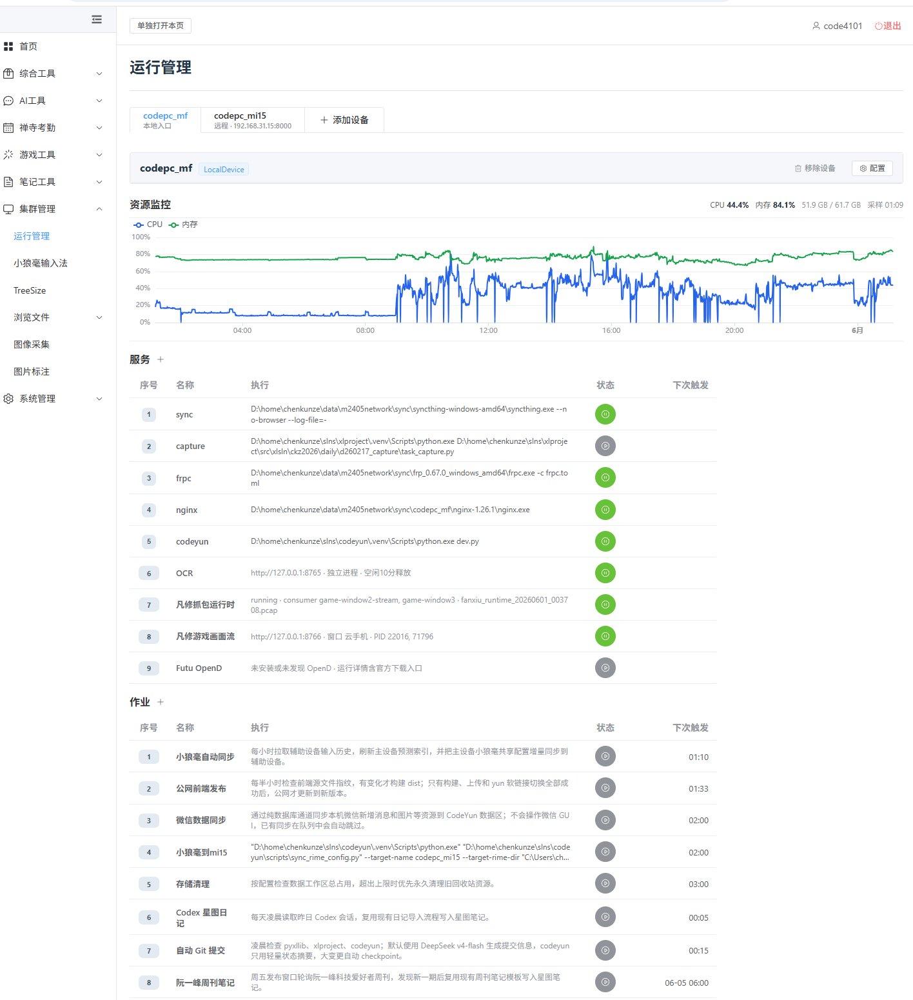
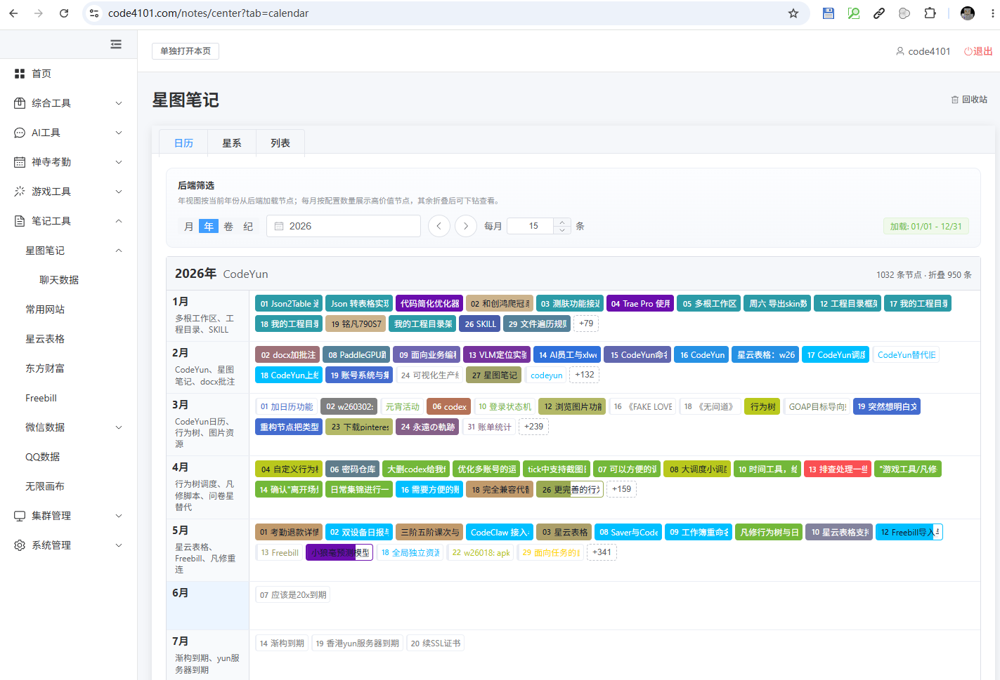
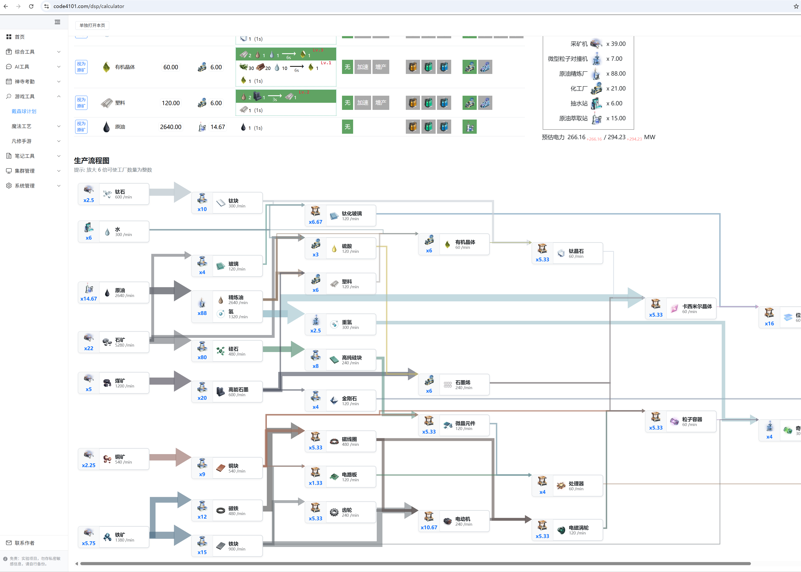

# CodeYun

[简体中文](README.zh-CN.md)

Website: https://code4101.com/

CodeYun is a local-first, self-hosted productivity and automation platform for individuals and small teams.

It grew from real daily workflows, but the core modules are designed as reusable building blocks: knowledge graph notes, spreadsheet-driven data workflows, task scheduling, cluster/process management, logs, and lightweight operational tools.

## Highlights

- **Knowledge graph notes**: Manage notes as structured entities and relationships, with reusable filtering programs for different views such as lists, global graphs, and calendar-based workflows.
- **Spreadsheet workflows**: Import, rebuild, validate, and expose spreadsheet-backed data through backend APIs and focused utility pages.
- **Task and job management**: Define reusable task types, run long-lived jobs, inspect status, and keep scheduling configuration separate from source code.
- **Cluster/process management**: Register local or remote devices, start and stop tasks, collect logs, and monitor task state from a single UI.
- **Operational tooling**: Provide small, practical tools for AI-assisted workflows, file/PDF handling, configuration, diagnostics, and development checks.
- **Developer-friendly runtime**: Use a consistent `uv` + FastAPI + Vue/Vite workflow with tests, production checks, environment modes, and documented conventions.

## Use Cases

- Build a self-hosted dashboard for personal or small-team automation.
- Maintain knowledge notes as graph data instead of isolated documents.
- Turn recurring spreadsheet operations into repeatable API-backed workflows.
- Manage background services across multiple local or remote machines.
- Collect project-specific tools into a coherent internal platform instead of scattered scripts.

## Screenshots

### Cluster and Task Management



Manage local and remote devices, inspect resource usage, supervise services, and schedule recurring jobs from one dashboard.

### Knowledge Graph Notes



Organize notes as graph entities, use rule-based filters, and switch between calendar, graph, and list-oriented workflows.

### Visual Planning Tools



Host focused domain tools inside the same platform, including interactive calculators, planners, and visual workflow surfaces.

## Documentation

- [Module Guide](docs/modules.md): feature overview for notes, spreadsheets, cluster management, jobs, and utility tools.
- [中文模块说明](docs/modules.zh-CN.md): 中文功能说明、安装和使用入口。
- [Repository conventions](AGENTS.md): local development, test, frontend, deployment, and maintenance conventions.

## Tech Stack

- **Backend**: Python, FastAPI, SQLModel, APScheduler, Uvicorn
- **Frontend**: Vue, Vite, TypeScript, Element Plus
- **Runtime**: `uv`, local SQLite/data workspaces, optional self-hosted deployment
- **Testing**: `pytest` for backend behavior and integration checks

## Quick Start

Run from the repository root:

```bash
uv sync
npm install --prefix frontend
uv run dev.py
```

Then open:

- Frontend: http://localhost:5173
- Backend API: http://localhost:8000/docs

Public website: https://code4101.com/

`dev.py` is the recommended development entrypoint. It starts and supervises the backend and frontend development servers, while keeping independently managed cluster tasks separate from the dev process itself.

The default development behavior can be configured with:

- `CODEYUN_DEV_CHECK_INTERVAL_SECONDS`
- `CODEYUN_DEV_BACKEND_RELOAD_COOLDOWN_SECONDS`
- `CODEYUN_DEV_BACKEND_RELOAD_MODE`

To use Uvicorn's built-in reload mode instead:

```bash
uv run dev.py --backend-reload-mode uvicorn
```

## Run Convention

- Run Python commands through `uv run`.
- Avoid relying on global Python or unrelated virtual environments.
- Use `uv run dev.py` for the integrated development environment.
- Use `uv run pytest` for tests.
- See [AGENTS.md](AGENTS.md) for detailed repository conventions.

## Common Commands

```bash
# Backend tests
uv run pytest

# Frontend development
npm run dev --prefix frontend

# Backend only
uv run python -m uvicorn backend.app:app --reload --host 0.0.0.0 --port 8000

# Frontend type/build check
npm run check --prefix frontend

# Local production-style check
uv run python scripts/check_prod.py
```

## Environment Modes

- `development`: used by `dev.py`, with development CORS and hot-reload behavior.
- `test`: used by automated tests, avoiding local `.env` leakage.
- `production`: disables public API docs by default and uses production-oriented settings.

Backend settings are centralized in [`backend/core/settings.py`](backend/core/settings.py) and can be configured through `.env` or system environment variables.

## Project Layout

```text
codeyun/
├── backend/          # FastAPI backend, APIs, services, standard modules
├── frontend/         # Vue/Vite frontend
├── docs/             # Design notes and AI-maintenance context
├── scripts/          # Maintenance and data workflow scripts
├── tests/            # Backend tests
├── dev.py            # Integrated development supervisor
├── pyproject.toml
└── AGENTS.md
```

## Maintenance Notes

The repository previously contained a GitHub Actions deployment flow, but that flow has been removed. Current production deployment does not depend on repository-local deployment workflows. If the old deployment approach is needed, see [docs/自动部署恢复档案.md](docs/自动部署恢复档案.md).

## License

[Apache License 2.0](LICENSE)
