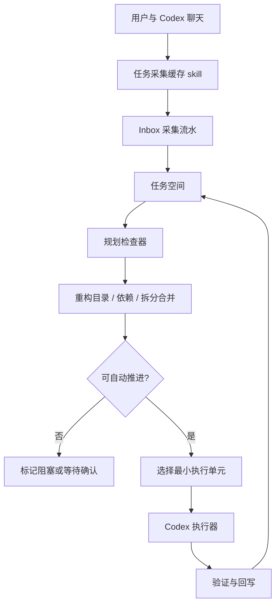

# AI 任务采集与自动化执行体系设计

## 背景与目标

Codex 聊天里的用户输入不总是“立即执行任务”。同一句话可能是上下文、草稿、偏好、任务候选、模式声明或可沉淀经验。如果系统看到 skill 名称就立刻执行，会把“提及某个工作方式”和“要求现在执行”混在一起。

本体系把聊天输入、任务组织和实际执行拆成三个正交层次：

- 采集层：持续接收用户输入，只做记录和轻整理。
- 任务空间：维护任务树、任务文档、状态、依赖和证据。
- 自动化执行层：周期性重新读取完整任务空间，重构依赖和优先级，选择一个最小可验证步骤推进。

目标不是做一个更复杂的 todo，而是建立一个“AI 工作事实源”。任务正文保存当前局面，原始流水和执行记录保存在证据层。

## 总体设计



## 模块边界

### 采集层

职责：

- 保存原文、来源、采集时间。
- 默认进入 `Inbox / 待整理`。
- 可做轻量标签和去重提示。
- 由 Codex 侧 skill、CLI 或 API 写入任务空间。

不负责：

- 不执行任务。
- 不改代码。
- 不决定最终优先级。
- 不把 skill 提及当成执行命令。
- 不在任务系统页面提供常驻采集器。

### 任务空间

职责：

- 保存任务树和任务状态。
- 每个任务维护文档式当前状态。
- 保存证据层：采集来源、执行记录、验证摘要、历史决策。
- 区分完成和归档。

任务正文不是对话流水，而是当前棋局式状态：

- 目标
- 当前状态
- 背景与约束
- 已知事实
- 依赖与阻塞
- 下一步
- 完成标准
- 结果摘要

任务正文的判断标准是：下一次规划检查不读聊天历史，也能知道当前局面和下一手。采集原文、执行过程、测试输出、失败原因和历史推理都属于证据层；它们可以被摘要进任务正文，但不应以流水形式堆进任务正文。

任务正文保存为纯文本状态文档。旧富文本迁移、页面粘贴或外部导入带来的空段落 HTML（例如 `<p><br></p>`）应在任务空间规范化入口清洗掉；简单段落和换行 HTML 可以降级为普通文本。执行包和规划检查只读取清洗后的任务文档，避免把编辑器残留标记当成上下文事实。

### 规划检查器

职责：

- 每轮重新读取完整任务空间。
- 整理当前全部 Inbox，归并重复信息，不把待整理采集长期留给后续轮次。
- 重构任务目录，必要时拆分、合并、提升或降低层级。
- 分析依赖，优先推进前置任务。
- 选择一个低风险、上下文足够、可验证的小步。
- 将本轮选择和理由写回任务空间。

依赖重整是每次规划检查的固定动作。未完成或缺失的 `dependsOn` 会让任务进入 `blocked`，并把阻塞原因写入任务文档的“依赖与阻塞”；当前置任务完成后，规划检查可以解除由系统依赖造成的阻塞，再把任务放回可推进队列。用户手工写入的阻塞说明不会被无条件清掉。

父任务默认是目标、范围和状态摘要容器；只要它还有未完成、未归档的子任务，就不作为直接执行候选。规划器应优先选择满足依赖的叶子任务作为最小执行单元。若所有叶子任务都因等待用户确认、阻塞或手工策略而不可执行，本轮应返回无候选或等待状态，而不是退回去执行父级容器。

不负责：

- 不依赖上一轮内存继续推进。
- 不默认读取归档全文。
- 不自动归档已完成任务。

### 执行器

职责：

- 基于规划器选中的单个小任务创建执行快照。
- 执行一个可验证步骤。
- 跑必要检查。
- 回写结果摘要、验证证据、剩余风险。

执行回写采用“双写但不同义”的模型：

- 任务文档更新当前局面，例如当前状态、下一步、已知事实、依赖与阻塞、结果摘要。
- 执行记录保留本轮动作、验证、剩余风险和状态，用于审计、复盘和必要时回溯。

这类似下棋：棋盘记录当前局面，棋谱记录每一步。规划器优先读棋盘，只有在判断不清、需要追溯来源或归档检索时才读棋谱。

执行期间采集通道持续开放。新采集项不应让当前小步频繁改目标；它们进入任务空间，并影响下一次规划检查。

## 状态与生命周期

```text
capture inbox
-> triaged
-> planned
-> ready
-> running
-> blocked
-> done
-> review_for_archive
-> archived
```

- `done`：任务已完成，但仍保留在直接规划集，供近期参考。
- `review_for_archive`：系统建议归档，等待用户确认。
- `archived`：用户确认收纳，默认不进入每轮直接规划分析。
- 删除只用于误采集或清理，不是正常完成路径。

规划检查只从未关闭任务中选择执行候选。`done` 和 `review_for_archive` 保留在直接规划集作为近期上下文，但不会再次进入执行包；`archived` 默认不参与直接规划、运行中计数和候选选择。其他任务依赖 `done` 任务时视为依赖已满足，依赖 `archived` 任务时需要人工确认是否仍应阻塞。

`blocked` 任务也不进入执行候选。只有当阻塞是系统依赖阻塞，且下一次规划检查确认前置任务已经完成时，规划器才会把它解除为 `ready` 后再参与候选排序。用户手写的阻塞说明、风险阻塞和等待确认不应被自动执行绕过。

## 执行策略

每个任务必须显式标记执行策略：

- `manual_only`：只能用户明确要求执行。
- `ask_before_execute`：自动化可建议，执行前需要用户确认。
- `auto_report`：可自动生成报告或分析，不改业务代码。
- `auto_safe`：可自动推进低风险、小范围、可验证工作。

这保证“会话恢复”这类 skill 被提及时，可以被记录为上下文或模式候选，而不是直接触发执行。

## 归档原则

完成状态是重要参考素材，不能直接删除。归档应由用户审核决定。

页面左侧提供轻量归档审核队列，收纳 `review_for_archive` 任务。用户只需要在队列里确认“归档”或“保留”：归档后任务进入 `archived`，默认退出直接规划；保留后回到 `done`，继续作为近期完成参考。
页面里的“完成、建议归档、保留、归档”属于用户审核写操作，不应只依赖延迟自动保存，也不应由前端复制状态迁移规则。页面执行前先提交已有编辑，再调用后端 `review-action` API；API 在锁内校验 `expected_fingerprint` 并应用统一状态机。若后台采集、规划检查或回写已经改变任务空间，返回 409，页面重新加载最新局面，避免在旧页面上把任务移入完成或归档状态。

规划检查器默认读取：

- 直接规划集：未归档任务、近期完成任务、待归档审核任务。
- 背景参考集：与当前候选任务相关的完成任务摘要。
- 归档集：默认只读索引；命中关键词、依赖、相似任务时再间接调度检查。

## v1 实施

当前前端页面 `frontend/src/standard/notes/task-system/page.vue` 已实现 v1：

- 直接规划集任务树。
- 文档式任务状态。
- 自动化执行包。
- 证据层。
- 手动触发的规划检查。
- 完成、建议归档、归档审核、用户归档。

任务空间已经迁移为后端事实源：

- API：`/api/ai-task-space`
- 核心服务：`backend/core/ai_task_space.py`
- API 路由：`backend/api/ai_task_space.py`
- 存储位置：`CODEYUN_DATA_DIR/ai-task-space/user_<id>.json`

前端仍会读取旧 localStorage 数据做一次性迁移，但后续读写以后端 JSON 为准。这样 Codex automation、页面和未来脚本可以围绕同一份任务空间协作。

任务空间接口返回不落盘的 `_fingerprint`，页面做全量保存时必须带回该指纹。若 Codex 采集脚本、规划检查或执行回写已经在后台更新了同一份任务空间，后端会拒绝过期保存，页面应重新加载最新状态，而不是用旧页面数据覆盖后台新增内容。

Codex 侧只读/规划检查脚本也会输出可用于后续写操作的指纹：`ai_task_space_validate_automation_contract.py` 输出 `current_fingerprint` 表示当前已保存任务空间版本，`validated_fingerprint` 表示本次校验用的空间版本；默认模拟规划检查时后者只代表内存结果。`ai_task_space_plan_once.py` 保存新规划检查后输出新的 `current_fingerprint`。确认继续、应用建议、完成/归档审核等后续写操作应使用最近一次读取到的 `current_fingerprint` 作为 `--expected-fingerprint`。

所有成功修改任务空间的 Codex 脚本也返回新的 `current_fingerprint`。连续处理多个建议、确认、审核或执行回写时，应把上一步返回的新指纹继续传给下一步的 `--expected-fingerprint`，不要复用最早读取到的旧指纹。

所有会修改任务空间 JSON 的入口必须走同一套文件级互斥写入：采集、规划检查、建议应用、执行回写和页面全量保存都在锁内完成“读取当前空间 -> 计算下一状态 -> 原子替换文件”。这保证执行期间用户继续发送新采集时，后台规划检查或页面保存不会把采集项覆盖掉。普通读取、审计和执行包生成保持只读，不持有写锁。

当前 API：

- `GET /api/ai-task-space`：读取当前用户任务空间。
- `PUT /api/ai-task-space`：保存完整任务空间。
- `POST /api/ai-task-space/captures`：追加采集项。
- `POST /api/ai-task-space/captures/{capture_id}/promote`：将采集项提升为任务。
- `POST /api/ai-task-space/planner/run-once`：运行一次确定性规划检查。
- `POST /api/ai-task-space/planner/suggestions/{suggestion_id}`：应用或忽略规划整理建议，可带 `_fingerprint` 防止页面旧状态覆盖后台变化。
- `GET /api/ai-task-space/planner/execution-packet`：读取当前任务的自动化执行包。
- `GET /api/ai-task-space/audit`：只读审计任务空间不变量，例如是否只有一个 `running`、最新选中任务是否存在、依赖是否缺失。
- `GET /api/ai-task-space/automation-health`：只读模拟一次规划检查，验证执行契约和真实 Codex automation 配置是否同步，不保存任务空间；返回 `currentFingerprint` 表示当前已保存版本，`validatedFingerprint` 表示本次模拟校验版本。
- `POST /api/ai-task-space/tasks/{task_id}/execution-records`：追加执行回写，更新任务当前局面并保留执行记录。
- `POST /api/ai-task-space/tasks/{task_id}/confirm-user-ready`：用户审核后解除“等待用户确认”的最近执行态，追加确认记录，等待下一次规划检查重新评估；页面应带 `expected_fingerprint`，旧状态返回 409 后重新加载。
- `POST /api/ai-task-space/tasks/{task_id}/review-action`：执行任务审核动作，`action` 支持 `mark_done / request_archive_review / keep_unarchived / archive`；所有动作在后端统一写状态文档、证据层和时间字段，并带 `expected_fingerprint` 防旧页面覆盖。

Codex 会话中处理用户明确的完成或归档审核指令时，使用同一套状态机脚本，不手改 JSON：

如果只是要重新读取当前已保存任务空间，而不推进规划检查、不模拟下一轮、不改任何状态，先用只读状态脚本：

```bash
uv run python scripts/ai_task_space_status.py \
  --username code4101 \
  --json
```

该脚本返回 `current_fingerprint`、当前统计、等待确认任务、归档审核任务、open planner suggestions 和最近规划检查摘要。它用于执行管理前重新看当前棋局；需要校验 automation 契约或模拟下一轮时才使用 `ai_task_space_validate_automation_contract.py`。
状态脚本还返回 `action_hints`，用结构化 `argvTemplate` 给出后续安全脚本的调用形状，例如确认等待任务、应用/忽略建议、归档审核，并自动带上当前 `current_fingerprint`。这些只是可执行提示，不代表自动批准；真正执行仍要来自用户指令、页面动作或明确工作流。
这些提示绑定同一个只读快照，并由 `action_hint_contract` 标明 `requiresApproval / staleAfterAnyWrite / reloadAfterSuccess`。执行任意一个写操作成功后，旧快照上的其它 hint 都应视为过期，必须重新运行 status 或 planning check 后再继续处理。

```bash
uv run python scripts/ai_task_space_review_action.py \
  --username code4101 \
  --task-id <task_id> \
  --action mark_done \
  --expected-fingerprint <fingerprint> \
  --json
```

采集不放在任务系统页面里操作。Codex 侧采集使用：

```bash
uv run python scripts/ai_task_space_capture.py \
  --username code4101 \
  --source "Codex 当前会话" \
  --context-kind task \
  --tag 后续 \
  --project-path "D:\home\chenkunze\slns\codeyun" \
  --text "<要采集的原始任务、上下文或约束>" \
  --json
```

长上下文采集应使用 stdin 或 `--file`，避免命令行转义和长度问题：

```bash
[Console]::OutputEncoding = [System.Text.UTF8Encoding]::new()
Get-Content $env:TEMP\codeyun\capture.txt -Raw |
  uv run python scripts/ai_task_space_capture.py \
    --username code4101 \
    --source "Codex 当前会话" \
    --context-kind constraint \
    --tag 约束 \
    --json
```

采集字段保持轻量：`rawText` 是原始素材，`source` 是来源，`capturedAt` 由系统生成；可选 `tags / contextKind / projectPath` 用于让后续规划检查理解素材类型和项目归属。采集脚本只写入 Inbox，不运行规划检查，不提升任务，也不执行代码。成功 JSON 返回新的 `current_fingerprint`，用于后续连续的 guarded write。

Codex 侧技能分层：

- `任务采集缓存`：只把新输入记录到 Inbox，不运行规划检查、不执行、不改任务树。
- `task-space-execution`：管理既有任务空间状态，例如运行/检查规划检查、确认等待任务、应用/忽略规划建议、追加执行回写、同步 automation 契约。

这两个 skill 的边界必须保持清晰：用户提出新想法时走采集；用户审核既有任务、既有建议或既有执行包时走执行管理。

规划检查提升 Inbox 时会使用 `contextKind` 生成任务属性，而不是把所有采集都当成待执行任务：

- `task` -> `task / ask_before_execute / medium`，进入候选执行体系。
- `context` -> `context / manual_only / low`，只作为上下文沉淀。
- `constraint` -> `decision / manual_only / medium`，作为约束或决策条件，等待绑定到相关任务。
- `preference` -> `context / manual_only / low`，作为用户偏好沉淀。
- `knowledge` -> `learning_case / manual_only / low`，作为经验案例沉淀。

`manual_only` 节点保留在直接规划集供规划检查和用户参考，但不会被自动置为可推进、选为执行候选，也不会生成 `nextStep / doneCriteria / split` 这类执行准备建议。它仍可参与依赖说明、重复合并等任务空间结构整理。这样采集层仍然简单，执行层在每轮重读任务空间时能区分“要做的事”和“做事时要看的材料”。

真实 Codex automation 第一阶段不应直接执行代码，而应调用规划检查后读取最新任务空间，把选中的 `running` 任务作为候选执行输入，再按执行策略决定是否只报告、等待确认或推进小步。

本地 cron / Codex automation 可以先调用脚本入口：

```bash
uv run python scripts/ai_task_space_plan_once.py --username code4101 --json
```

规划检查脚本会保存新的规划日志，并在 JSON 顶层返回 `current_fingerprint`。如果随后要基于这次规划检查输出处理建议、确认任务或执行审核动作，应把该值传给对应脚本的 `--expected-fingerprint`。

Codex automation 的提示词不要手写散落在配置里，使用脚本生成：

```bash
uv run python scripts/ai_task_space_automation_prompt.py --username code4101
```

真实 Codex automation 配置也不要手工复制 prompt。需要安装或同步 `~/.codex/automations/ai/automation.toml` 时，使用：

```bash
uv run python scripts/ai_task_space_sync_automation.py \
  --username code4101 \
  --json
```

该脚本默认写入 `~/.codex/automations/ai/automation.toml`，并立即用同一套校验逻辑确认 prompt、cwd、本地执行环境和启用状态匹配。只想预览 TOML 时加 `--dry-run`；测试或临时安装可用 `--path <automation.toml>` 指向其他位置。

改动自动化契约后，应先跑只读验证器。默认模式会在内存中模拟一次规划检查，但不会保存任务空间；它检查 `audit`、`execution_packet`、`automation_directive`、`completionTemplate`、预算上限和回写 CLI 是否仍然互相匹配：

```bash
uv run python scripts/ai_task_space_validate_automation_contract.py \
  --username code4101 \
  --automation-toml \
  --json
```

如果只想检查当前已保存的任务空间，不模拟下一次规划检查，可以加 `--use-current`。`--automation-toml` 不带路径时默认检查 `~/.codex/automations/ai/automation.toml`，确认真实 Codex automation 的 prompt、`ACTIVE` 状态、本地执行环境和仓库 cwd 没有漂移；也可以显式传入其他 TOML 路径。验证器只读，不会自动修改 `.codex` 配置。验证失败时应先修复契约漂移，再启用或等待真实 automation。

验证器 JSON 顶层的 `current_fingerprint` 来自当前已保存任务空间，可用于后续 guarded write；默认模拟规划检查时的 `validated_fingerprint` 只用于理解校验上下文，不应用作已保存空间版本。

验证器同时检查 automation prompt 是否明确包含：每轮全量读取任务空间、不能凭聊天记忆选择任务、旧规划检查输出/旧页面/上轮执行包在写入后过期、新需求必须通过采集脚本进入 Inbox 并等下一次规划检查处理。这些语句属于执行安全边界，不能为了精简 prompt 随意删除。

任务系统页面顶部显示同一套健康结果：空间审计负责任务空间不变量，自动化健康负责真实定时任务配置和执行契约是否同步。页面健康条只展示状态，失败原因、配置细节、当前候选任务和最近回写折叠展示，避免把自动化内部细节铺到任务详情区。最近回写来自任务空间已保存执行记录，只用于观测真实运行结果，不触发再次执行。
自动化健康折叠区可以显示当前保存版本的短指纹，用于判断页面、脚本和自动化校验是否基于同一版任务空间；模拟规划检查产生的 `validatedFingerprint` 只用于校验上下文，不表示已落盘版本。
如果页面当前持有的 `_fingerprint` 与健康检查返回的 `currentFingerprint` 不一致，说明后台采集、规划检查、回写或其它页面已经更新了任务空间。页面应提示“页面旧版”，并提供载入最新快照的轻量动作；旧版页面上的编辑控件、保存、规划检查、建议审核、完成、归档、确认继续和执行回写都应被禁用或阻止，不能让用户基于旧棋局继续编辑或写入。

规划检查处理采集项时，只会把同名或近似标题的新采集归并到仍在直接推进的活跃任务中。`done`、`review_for_archive`、`archived` 任务都被视为历史局面或归档候选，不再接收新的采集上下文；同名的新需求会创建新的任务节点，并通过证据层和标题保留与旧任务的可追溯关系，避免把已完成状态改写成新的未完成局面。

### 规划重构建议

规划检查每轮会全量读取任务空间，并生成 `plannerSuggestions`。这层只表达“任务树应如何整理”的建议，不自动应用结构变更，避免 planning check 在用户未审核时擅自拆分、合并或归档任务。

规划检查日志每轮都可以记录本轮选择和检查动作，但任务证据层应避免无意义膨胀：如果任务证据层已有候选记录，后续规划检查只在 planner log 中记录本轮选择或继续候选，不再重复追加“规划检查选为本轮执行候选”证据。每次规划检查还会顺手压缩历史遗留的同类候选证据，只保留最新一条；真正的每轮选择细节以 planner log 为准。

当前建议类型：

- `document`：任务缺少下一步、依赖说明等执行必需文档。
- `split`：任务上下文过长且没有子任务，建议拆成更小的可验证步骤。
- `merge`：存在重复未关闭任务，建议合并上下文和证据。
- `dependency`：结构化依赖和文档说明不一致，建议补齐。
- `archive`：任务已完成并有结果摘要，建议进入用户归档审核。

`plannerSuggestions`、`plannerLogs[].suggestionIds` 和 `execution_packet.plannerSuggestions` 都是观测与审核材料。执行器可以在 `ask_user` 或 `report_only` 模式下回写建议摘要，但不能把建议当作已经发生的任务事实；真正改变任务树仍应通过页面编辑、明确 API 或用户确认后的后续动作完成。

任务系统页面展示整理建议时应优先展示可审核预览，而不是底层字段名。拆分建议要能看出将创建哪些有序子任务和前置关系；合并建议要明确“保留哪个任务、收纳哪些重复任务并转入待归档审核”。用户应能在应用前判断结构变化的方向。

建议支持受控审核动作：

- `apply`：只对低风险建议一键应用，例如补 `nextStep`、补 `doneCriteria`、把结构化依赖转写到文档、把已完成任务推进到 `review_for_archive`。
- `dismiss`：用户确认暂不处理后标记为已忽略；后续规划检查不会立刻把同一条建议刷回。
- `split` / `merge` 这类会创建、关闭或重连多个节点的建议必须携带结构化 `preview`。页面先展示将新建的子任务、主任务和待收拢重复任务；只有用户点击应用后，后端才按 preview 受控改写任务树。

Codex 会话里如果用户明确要求“应用/忽略某条整理建议”，不要手工改任务 JSON。使用建议审核脚本：

```bash
uv run python scripts/ai_task_space_planner_suggestion.py \
  --username code4101 \
  --suggestion-id <suggestion_id> \
  --action apply \
  --json
```

忽略建议：

```bash
uv run python scripts/ai_task_space_planner_suggestion.py \
  --username code4101 \
  --suggestion-id <suggestion_id> \
  --action dismiss \
  --json
```

该脚本只处理规划建议审核，不运行新规划检查、不执行业务代码。若要防止基于旧页面或旧规划检查输出处理建议，可加 `--expected-fingerprint <fingerprint>`；过期时脚本会拒绝写入，要求重新读取任务空间。
脚本成功后返回新的 `current_fingerprint`，可用于连续处理下一条建议。

拆分应用只创建子任务并把父任务保留为目标容器，不会直接执行新子任务。拆分出的子任务按预览顺序形成前置依赖链：第一个子任务无前置依赖，第二个依赖第一个，第三个依赖第二个。`split` 预览里的 `creates[]` 会用 `dependsOnPrevious / dependsOnTitle` 显示这个顺序关系，用户审核时能看到应用后不是并列任务。这样下一次规划检查会先推进前置整理任务，而不是把验证回写和实现任务并列抢占。合并应用保留一个主任务，合入重复任务的上下文、已知事实、依赖和证据，把重复节点改为 `review_for_archive`，等待用户审核是否最终归档。

建议状态包括 `open / applied / dismissed`。页面默认只显示 `open` 建议；已应用和已忽略建议继续留在任务空间里，并保留 `resolvedAt`，作为用户审核轨迹和后续规划检查抑制依据。

建议审核动作必须带上当前任务空间 `_fingerprint`。如果用户打开页面后，Codex 采集、规划检查或其他页面保存已经改动了任务空间，后端返回 409，页面重新加载后再处理建议，避免用旧任务树应用拆分、合并、归档或文档补齐。

`ai_task_space_plan_once.py` 只做规划检查并输出本轮候选任务、顶层 `planner_state`、`execution_packet`、`audit`、`planner_suggestions` 和 `automation_directive`，不直接修改业务代码。`planner_state` 是给 automation 快速判断本轮候选、阻塞总数和前几条阻塞原因的摘要；完整依据仍在 `execution_packet.planningDecision`。顶层 `planner_suggestions` 只包含仍待审核的 `open` 建议，已应用或已忽略建议保留在任务空间历史中，不作为本轮执行输入。`execution_packet.plannerSuggestions` 是面向执行器的待审核建议摘要；Codex automation 可以报告这些建议、提示风险或请求用户审核，但不能绕过 directive 自动应用。后续 Codex automation 的 prompt 应先读 `planner_state`，再以 `automation_directive` 为最高执行边界，并用 `audit` 和执行包做校验：

- `audit.ok = false` 且存在 error：不执行代码，回写阻塞或风险说明。
- `audit.ok = true` 或仅有 warning：继续读取执行包；warning 应进入剩余风险。

- `manual_only`：只报告，不执行。
- `ask_before_execute`：写入建议或等待用户确认。
- `auto_report`：允许生成分析报告并回写任务文档。
- `auto_safe`：允许推进低风险、可验证的小步，完成后回写验证证据。

`automation_directive` 是 automation 调度层的直接判定结果：

- `action`：`stop_for_audit / skip / ask_user / report_only / execute_safe`
- `shouldExecute`：本轮是否允许真正推进任务
- `shouldModifyCode`：本轮是否允许修改业务代码
- `shouldWriteBack`：本轮结束是否应写回执行记录
- `writebackStatus`：推荐回写状态，通常为 `progress` 或 `blocked`
- `stopReason`：本轮不执行时必须报告的原因
- `summaryHint`：回写摘要应覆盖的重点
- `requiredChecks`：结束前必须确认的检查项
- `completionTemplate`：结束报告和回写字段模板，约束 `summary / verification / remainingRisk / nextStep` 应写什么；`finalReport` 必须包含回写 `current_fingerprint` 字段，`notes` 必须要求读取回写 JSON，失败按 `code/message` 报告，成功记录新指纹。

automation 不应绕过该指令自行扩大权限；例如 `ask_user` 只能整理建议和回写状态，不能修改业务代码。`ask_user` 也不是每轮都必须写回：如果任务最近一条执行记录已经明确处于等待用户确认且未修改业务代码的状态，本轮 directive 可以保持 `action=ask_user`、`shouldExecute=false`，但返回 `shouldWriteBack=false`，只在 planner log 中保留本轮检查结果，避免证据层被重复的“等待确认”记录淹没。
这类“等待用户确认”的任务在后续规划中会被视为暂不可执行候选，并进入 `planningDecision.skipped`；后续只有用户确认、任务文档变更、策略调整或新增上下文改变局面后，才应重新进入候选池。
页面提供“确认继续”动作，用于用户审核后解除这类等待状态。该动作不会删除旧执行记录，而是追加一条“用户已确认继续推进”的执行记录，并同步刷新任务文档的 `currentState / nextStep`，使当前棋局从等待确认变成可重新评估；下一次规划检查再根据依赖、父子结构、风险和执行策略决定是否选中。

Codex 会话里如果用户明确表示某个等待确认任务可以继续，不应把这句话当作新采集项，也不应手工编辑 JSON；使用确认脚本写入同一类确认记录：

```bash
uv run python scripts/ai_task_space_confirm_user_ready.py \
  --username code4101 \
  --task-id <task_id> \
  --expected-fingerprint <fingerprint> \
  --note "<用户确认的范围或条件>" \
  --json
```

标题定位只适合人工维护且标题唯一的场景：

```bash
uv run python scripts/ai_task_space_confirm_user_ready.py \
  --username code4101 \
  --task-title "图鉴" \
  --expected-fingerprint <fingerprint> \
  --note "用户确认可以按当前任务文档继续。" \
  --json
```

这个脚本只负责解除等待确认态，不运行规划检查、不执行代码、不应用整理建议；下一轮仍由规划检查重新读取完整任务空间并决定是否推进。若确认动作基于页面、规划检查输出或之前读取到的任务空间，应传入当时的 `_fingerprint`，过期时拒绝写入，避免把旧等待态误确认。
脚本成功后返回新的 `current_fingerprint`，可用于后续紧接着的审核动作或建议处理。

执行包是 automation 的稳定交接格式：

- `decision.mode`：`skip / ask_user / report_only / execute_safe`
- `decision.reason`：为什么采用这个执行模式
- `decision.allowedActions`：本轮允许的动作边界
- `decision.forbiddenActions`：本轮禁止动作
- `budget`：本轮最多步骤、最多命令、最多可改文件、是否允许改代码、停止条件
- `planningDecision`：本轮候选池、跳过原因和选中依据。automation 执行前必须阅读它；如果页面请求的是用户手动选中的非最新规划候选任务，执行包会显式标出 `requestedTaskId`，避免把最新规划检查候选和当前查看任务混淆。
- `snapshot`：生成执行包时的任务文档摘要和规划日志位置，用于回写时判断上下文是否过期
- `writeback.cli`：执行完成后的回写命令形状；从用户任务空间生成时应带上 `--username`，避免 automation 写回默认账号。命令模板必须同时包含 `--summary / --verification / --remaining-risk / --next-step`，让执行结果回写成当前局面文档，而不是只写一条摘要。
- `writeback.argvTemplate`：和 `cli` 等价的结构化参数数组。Codex automation 应优先按数组替换占位值后执行，避免 PowerShell / shell 引号、中文空格和长文本导致参数错位；`cli` 主要用于页面展示和人工阅读。回写模板默认携带 `--json`，成功和失败都应能被 automation 按结构化结果读取。
- `prompt`：可直接作为 Codex automation 执行器提示词的任务摘要

审计结果是 automation 的健康门槛，不参与任务选择。任务选择仍由规划检查负责，审计只负责指出空间是否满足执行前提。
预算结果是 automation 的执行上限，不参与用户偏好表达；如果实际工作超过预算，本轮应停止并回写剩余风险，而不是自动扩大范围。
快照结果是 automation 的回写校验条件。自动化回写应带上 `snapshot.packetId` 和 `snapshot.taskUpdatedAt`；如果任务在执行期间已更新，回写会被拒绝，下一轮应重新运行规划检查。`packetId` 同时是幂等键：同一个 packet 的相同回写重复提交时不追加记录，即使 `snapshot.taskUpdatedAt` 已因第一次成功回写而过期也应返回成功；同一个 packet 若提交了不同摘要、状态或预算用量，会被视为重复回写冲突并要求重新运行规划检查。
执行记录保存每轮历史；任务文档只保留当前局面。回写时 `summary` 覆盖 `currentState`，`nextStep` 覆盖下一步，`verification` 和 `remainingRisk` 在任务文档中只保留最新的 `验证：...` / `剩余风险：...` 状态行，旧内容仍可从 executionRecords 和 evidenceLog 追溯，不在任务正文里累加成流水。
自动化结束前必须按 `automation_directive.completionTemplate.finalReport` 输出最终报告。若调用了回写 CLI，必须读取回写 JSON：`ok=false` 时报告 `code/message` 并停止；`ok=true` 时报告返回的 `current_fingerprint`，作为本轮实际写回成功的版本证据。

自动化执行完成后用专用脚本回写。自动化必须使用执行包里的 `task-id`、`packet-id` 和 `expected-task-updated-at`，不要根据当前聊天内容或最新规划候选重新猜目标任务：

```bash
uv run python scripts/ai_task_space_append_execution_record.py \
  --username code4101 \
  --task-id <task_id> \
  --packet-id <snapshot.packetId> \
  --expected-task-updated-at <snapshot.taskUpdatedAt> \
  --max-steps <budget.maxSteps> \
  --max-commands <budget.maxCommands> \
  --max-files-changed <budget.maxFilesChanged> \
  --steps-done <n> \
  --commands-run <n> \
  --files-changed <n> \
  --summary "<当前局面摘要>" \
  --verification "<验证命令或检查结果>" \
  --remaining-risk "<剩余风险>" \
  --next-step "<下一轮最小可执行步骤>" \
  --status progress \
  --json
```

人工维护或系统性进展回写不一定对应当前规划候选，这类回写可以使用精确标题定位，但标题必须唯一；如果同名任务不止一个，脚本会失败并要求改用 `--task-id`：

```bash
uv run python scripts/ai_task_space_append_execution_record.py \
  --username code4101 \
  --task-title codeyun \
  --summary "<当前局面摘要>" \
  --verification "<验证命令或检查结果>" \
  --remaining-risk "<剩余风险>" \
  --next-step "<下一轮最小可执行步骤>" \
  --status progress \
  --json
```

这个脚本只追加执行记录并更新任务文档，不重新规划、不执行代码、不归档任务。`--task-id` 和 `--task-title` 必须且只能提供一个。若提供了 `--max-steps / --max-commands / --max-files-changed`，实际用量超过任一上限时脚本会拒绝写入；automation 应停止本轮并重新运行规划检查，而不是删除预算参数后继续回写。若重复运行同一个 packet 的相同回写，脚本返回成功但不重复追加证据；若同一个 packet 的内容不一致，脚本拒绝写入。带 `--json` 时，预算超限、快照过期、重复冲突、标题歧义等失败都会输出 `{ ok: false, code, message }` 形状，automation 应按 `code` 判断本轮停止原因。
脚本成功后返回新的 `current_fingerprint`，供后续 guarded write 继续使用。

## 后续计划

1. 为规划器增加只读模式和执行预算。
2. 支持任务相似度检索和归档索引。
3. 增加用户审核面板：批量归档、确认自动执行策略、查看近期完成参考。


