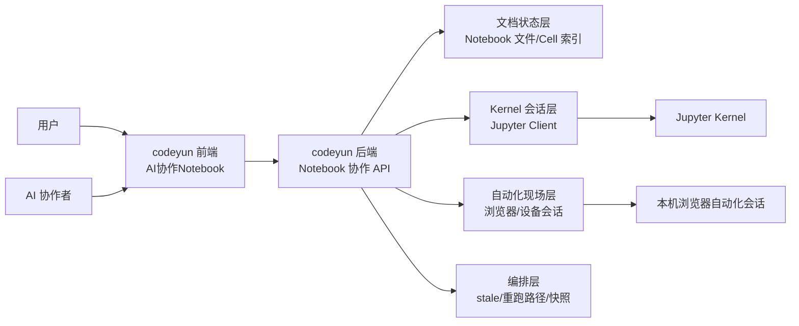

# 技术设计文档：CodeYun AI 协作 Notebook 控制台

## 1. 背景与目标

### 1.1 背景

当前围绕 Jupyter Notebook 的真实工作流，不只是“顺序执行一串 cell”，而是同时包含四类状态：

1. 文档编辑态：Notebook/Python 源码的当前版本。
2. Kernel 运行态：变量、函数、对象、浏览器 `tab`、中间结果。
3. 自动化现场态：登录中的浏览器、下载目录、页面弹窗、登录权限。
4. 协作者态：用户与 AI 对同一份 Notebook 的共同修改、重跑和排障动作。

现状中，这四类状态分散在 VS Code、磁盘文件、Jupyter kernel、浏览器自动化会话等多个入口里，导致以下问题反复出现：

- 用户编辑器里有未保存内容，AI 只能看到磁盘旧版本。
- Notebook 改了上游 cell，但下游仍运行旧函数或旧变量。
- 浏览器自动化依赖本机登录态，难以和 Notebook 会话绑定。
- AI 很难像真人那样“改 A、重跑 A、再跑 B”，只能退化成一次性代码执行器。

`codeyun` 已经具备三类相关基础：

- AI 工具页的统一前端入口。
- 后端长会话、流式任务和 WebSocket 广播能力。
- 考勤系统中已有“执行设备”与本机浏览器自动化的业务经验。

因此，适合在 `codeyun` 的 `AI工具` 下新增一个受控的 Notebook 协作控制台，统一上述状态，而不是继续依赖多个外部入口自由漂移。

### 1.2 目标

- 提供 `AI工具 / AI协作Notebook` 入口，作为 Notebook 协作的主入口。
- 统一管理 Notebook 文档态、Kernel 态和浏览器自动化会话态。
- 支持像真人一样分块调试：
  - 改 A
  - 保存 A
  - 重跑 A
  - 标记 B/C stale
  - 再运行 B
- 支持 AI 附着当前会话，而不是只会从零执行脚本。
- 与现有 `codeyun` 权限体系、长任务机制和执行设备语义兼容。

### 1.3 非目标

短期不做以下事情：

- 不重写一套完整的 Jupyter 编辑器。
- 不一开始就实现多人实时协同编辑（RTC）。
- 不在第一期支持任意语言内核。
- 不试图接管用户本地所有 VS Code/Jupyter 会话。

---

## 2. 总体设计

### 2.1 核心判断

本方案通过正交性审查，可以进入正式设计。原因是它将问题拆成了几个独立平面，而不是把“文档编辑、代码执行、浏览器现场、AI 协作”糊成一个大组件。

需要明确排除的错误方向是：

- 直接在 `codeyun` 中裸嵌一个 JupyterLab 页面。

这种做法的问题是：

- 文档状态仍由 Jupyter 前端主导，`codeyun` 无法判定“是否已保存”。
- Kernel 生命周期与 `codeyun` 会话脱节。
- 浏览器自动化会话仍是外部对象，不能纳入统一状态模型。
- `codeyun` 只能做外层导航，无法做 stale 标记、执行编排和权限约束。

因此，正确方向不是“套壳 Jupyter”，而是：

- 由 `codeyun` 持有会话主权。
- Jupyter 仅作为底层文档格式与 kernel 协议提供者。

### 2.2 架构总览



### 2.3 模块正交性分析

#### 2.3.1 文档状态层

- 只负责 Notebook 文件本身。
- 管理 cell 列表、cell id、源码、保存状态、最近修改人。
- 不负责执行，不直接接触浏览器会话。

#### 2.3.2 Kernel 会话层

- 只负责连接、启动、附着和执行 Jupyter kernel。
- 提供“运行指定 cell / 运行临时代码 / 读取变量摘要”的能力。
- 不决定页面如何展示，也不直接决定浏览器打开什么站点。

#### 2.3.3 自动化现场层

- 只负责浏览器自动化会话。
- 管理执行设备、已登录窗口、下载目录、会话标签。
- 不关心 notebook 的源码结构。

#### 2.3.4 编排层

- 负责“改动影响了哪些 cell”和“应该如何重跑”。
- 管理 stale 状态、依赖链、运行批次和快照。
- 不直接保存 Notebook 文件，也不直接控制浏览器。

#### 2.3.5 AI 协作层

- 只是对上述能力的受控调用者。
- AI 可以改 cell、触发执行、读取状态，但不绕过统一会话模型。

这几个层次解耦后，修改其中一层不会无意波及其他层。例如：

- 换一套 stale 判定规则，不影响 Kernel 连接协议。
- 更换浏览器自动化实现，不影响 cell 文档模型。
- 调整前端布局，不影响 Notebook 文件保存逻辑。

---

## 3. 详细设计

### 3.1 挂载位置与现有接入点

该功能适合挂在 `AI工具` 下，原因是其本质是“AI 协作式开发/调试控制台”，而不是通用系统设置页。

当前可复用入口包括：

- `frontend/src/standard/tools/index.ts`
  - 负责 AI 工具页面注册。
- `frontend/src/layout/MainLayout.vue`
  - 负责 `AI工具` 子菜单的手写挂载。
- `backend/api/ai_chat.py`
  - 可参考其 AI 工具 API 的组织方式。
- `backend/api/codex_sessions.py`
  - 可参考其长会话、摘要与状态模型。
- `backend/api/websocket_manager.py`
  - 可复用其实时状态广播能力。

### 3.2 前端页面结构

建议新增页面：

- 页面键：`AiNotebookLab`
- 菜单分组：`AI工具`
- 页面标题：`AI协作Notebook`

前端布局建议三栏：

1. 左栏：会话与文档导航
   - Notebook 列表
   - 当前 session 列表
   - 执行设备/浏览器会话摘要

2. 中栏：Cell 编辑与运行区
   - Cell 列表
   - 当前 cell 源码
   - 保存、运行当前 cell、运行到此、运行选中代码

3. 右栏：运行态与现场态
   - Kernel 状态
   - 最近输出
   - 变量摘要
   - 浏览器现场摘要
   - stale 标记与依赖提示

### 3.3 后端核心模块

建议新增后端模块：

- `backend/api/ai_notebook_lab.py`
- `backend/core/notebook_lab/`

其中 `backend/core/notebook_lab/` 可进一步拆为：

- `document_store.py`
  - 读写 `.ipynb`
  - 维护 cell 索引和元数据
- `kernel_runtime.py`
  - 启动/附着 kernel
  - 运行 cell / 运行代码片段
- `automation_session.py`
  - 绑定执行设备与浏览器自动化会话
- `orchestrator.py`
  - stale 标记
  - 运行链路
  - 快照与恢复
- `schemas.py`
  - API 与存储模型

### 3.4 状态模型

建议以 `NotebookSession` 为主模型，把文档、kernel 与浏览器现场绑定起来。

#### 3.4.1 NotebookSession

```python
class NotebookSession(BaseModel):
    id: str
    notebook_path: str
    execution_device_entry_id: str | None = None
    kernel_id: str | None = None
    browser_session_id: str | None = None
    status: Literal["idle", "running", "error", "stale"]
    created_at: float
    updated_at: float
```

#### 3.4.2 CellState

```python
class CellState(BaseModel):
    cell_id: str
    index: int
    title: str | None = None
    dirty: bool = False
    stale: bool = False
    last_run_at: float | None = None
    last_run_status: Literal["success", "error", "running", "never"] = "never"
```

#### 3.4.3 BrowserAutomationBinding

```python
class BrowserAutomationBinding(BaseModel):
    browser_session_id: str
    execution_device_entry_id: str
    provider: Literal["drissionpage", "other"] = "drissionpage"
    window_label: str | None = None
    tab_count: int = 0
    attached_at: float
```

### 3.5 核心交互原则

#### 3.5.1 单一可信入口原则

一旦该功能上线，协作场景下必须明确：

- Notebook 协作以 `codeyun` 前端保存后的磁盘版本为准。
- 未保存的 VS Code/Jupyter 前端内存态，不属于共享状态。

否则系统永远无法知道：

- AI 改的是不是你现在看到的版本。
- 当前 kernel 执行的是哪一份源码。

#### 3.5.2 保存后再执行原则

所有“运行当前 cell / 运行到此 / AI 重跑”动作，都应建立在已保存的文档版本之上。

这意味着：

- 若当前 cell 有未保存改动，先提示保存。
- 后端执行前应记录一个文档版本号或 hash。

#### 3.5.3 改上游即标 stale 原则

当 A 被修改并保存后：

- A 下游依赖的 B/C 立即标记为 stale。
- stale 不代表禁止运行，但意味着“当前结果可能基于旧实现”。

第一期可以先用显式手工标记或简单顺序规则：

- “改动某个 cell 后，其后的所有 cell 默认为 stale”

后续再演进到更精细的依赖模型。

### 3.6 Kernel 接入方式

Kernel 接入采用 Jupyter 标准能力，不自己发明协议：

- 启动新 kernel
- 附着现有 `kernel-*.json`
- 执行 cell
- 执行临时代码片段
- 抓取 stdout / stderr / 富输出摘要

第一期重点不是做多内核支持，而是把“同一 session 里的共享上下文”做稳。

### 3.7 浏览器自动化会话接入方式

这部分必须吸收考勤系统现有经验：浏览器自动化不是纯后端无状态任务，而是强依赖执行设备和登录态的长会话。

因此需要：

- 浏览器自动化会话按设备绑定。
- NotebookSession 显式记录 `execution_device_entry_id`。
- 自动化对象不应每次执行都重新创建全新浏览器。

短期建议：

- 先复用已有设备语义。
- 一个 NotebookSession 只能绑定一个执行设备。
- 一个执行设备上允许多个 NotebookSession，但浏览器会话要清晰区分来源。

### 3.8 API 草案

#### 3.8.1 会话管理

- `POST /api/ai-notebook/sessions`
  - 创建会话，指定 notebook 路径和执行设备。
- `GET /api/ai-notebook/sessions`
  - 列出会话。
- `GET /api/ai-notebook/sessions/{id}`
  - 查看会话详情。
- `DELETE /api/ai-notebook/sessions/{id}`
  - 关闭会话。

#### 3.8.2 文档与 Cell

- `GET /api/ai-notebook/sessions/{id}/cells`
- `PUT /api/ai-notebook/sessions/{id}/cells/{cell_id}`
  - 更新指定 cell。
- `POST /api/ai-notebook/sessions/{id}/save`
  - 持久化 Notebook。

#### 3.8.3 执行

- `POST /api/ai-notebook/sessions/{id}/run-cell`
- `POST /api/ai-notebook/sessions/{id}/run-to-cell`
- `POST /api/ai-notebook/sessions/{id}/run-code`
- `POST /api/ai-notebook/sessions/{id}/interrupt`

#### 3.8.4 状态读取

- `GET /api/ai-notebook/sessions/{id}/variables`
- `GET /api/ai-notebook/sessions/{id}/outputs`
- `GET /api/ai-notebook/sessions/{id}/browser-state`
- `GET /api/ai-notebook/sessions/{id}/stale-map`

#### 3.8.5 AI 协作动作

- `POST /api/ai-notebook/sessions/{id}/ai/patch-cell`
- `POST /api/ai-notebook/sessions/{id}/ai/probe`
- `POST /api/ai-notebook/sessions/{id}/ai/replay-path`

### 3.9 安全与权限

该能力至少涉及三类高风险操作：

- 修改磁盘 Notebook 文件。
- 执行任意 Python 代码。
- 控制已登录浏览器会话。

因此第一期必须限制：

- 仅超级管理员可用，或仅对白名单账号开放。
- Notebook 路径限制在允许目录下。
- 执行设备必须显式选择，不允许默认漂移。
- 所有 AI 修改和执行动作都要留审计日志。

---

## 4. 设计优势与权衡

### 4.1 优势

#### 4.1.1 真正统一状态

通过 `NotebookSession` 把文档、kernel 和浏览器自动化统一起来，能够根治下面这类问题：

- 磁盘文件和编辑器未保存内容分叉。
- kernel 里还是旧函数，文件里已经是新函数。
- 浏览器现场页和当前调试代码失去对应关系。

#### 4.1.2 更接近真人工作流

系统能够自然支持：

- 改上游工具函数
- 重跑上游 cell
- 观察中间输出
- 再继续下游调试

这比把 Notebook 当成一次性 API 执行器更符合真实排障方式。

#### 4.1.3 和现有业务兼容

当前考勤、微信支付、小鹅通等自动化都高度依赖：

- Windows 本机登录态
- 已打开浏览器 tab
- 设备身份

本设计没有回避这些现实约束，而是把它们正式纳入状态模型。

### 4.2 权衡

#### 4.2.1 不追求第一期就做成通用 IDE

这是刻意的取舍。

如果一开始就追求：

- 完整 Notebook 编辑器
- 实时多人协作
- 多语言支持
- 任意工作区通用化

项目会迅速膨胀，短期很难收敛。

#### 4.2.2 不把 Jupyter 前端当主系统

这样做会损失一部分现成 UI 能力，但换来的是：

- `codeyun` 拥有更高的状态掌控力。
- 权限、审计、设备绑定和 AI 协作逻辑都能放在主系统里统一治理。

---

## 5. 实施计划

### 5.1 第一期：最小可用版本

目标：先把“共享文档 + 共享 kernel + 共享浏览器会话”跑通。

范围：

1. 新增 `AI协作Notebook` 页面入口。
2. 支持打开一个指定 `.ipynb`。
3. 支持列出 cell、修改 cell、保存 notebook。
4. 支持附着或启动一个 Python kernel。
5. 支持运行指定 cell 和运行临时代码片段。
6. 支持查看最近输出和少量变量摘要。
7. 支持为 session 绑定一个执行设备和浏览器自动化会话。
8. 支持最简单的 stale 规则：
   - 改动某 cell 后，其后所有 cell 标为 stale。

暂不做：

- 多人实时协同编辑。
- 自动依赖图推导。
- 富媒体输出完整回放。
- 通用文件管理器。

### 5.2 第二期：协作增强

范围：

- 更精细的 stale/依赖图。
- 运行快照与回放。
- AI 定位“最近一次成功路径”。
- 浏览器现场截图、DOM 快照、下载任务状态面板。
- Notebook 会话恢复。

### 5.3 第三期：多人协作与产品化

范围：

- 协同编辑锁或 RTC。
- 更完整的审计日志。
- 模板化调试工作流。
- 和现有 AI 聊天、Codex 会话、任务系统联动。

### 5.4 主要风险

1. 用户仍从 VS Code/Jupyter 原生入口修改同一文件，导致状态分叉。
2. 浏览器自动化会话和 Notebook session 绑定不清，导致跨任务串台。
3. Kernel 长时间运行后状态污染，导致调试结果不可复现。
4. Notebook 文件本身存在大量自由格式和历史写法，cell 元数据规范需要渐进统一。

### 5.5 风险缓解策略

1. 第一阶段先限制使用场景，只对少量核心 Notebook 开放。
2. 强制要求通过 `codeyun` 保存后再执行。
3. 会话显式绑定执行设备，避免“后台偷偷换设备”。
4. 每次执行记录文档版本号、cell id 和运行结果摘要。

---

## 6. 推荐结论

推荐在 `codeyun` 中推进该方案，但分阶段实施。

最重要的不是“做一个新的 Notebook 网页”，而是建立一个由 `codeyun` 主导的统一状态模型：

- 文档状态统一
- kernel 状态统一
- 浏览器自动化会话统一
- AI 协作动作统一

只要这四个统一了，后续无论是接入考勤自动化、微信支付排障，还是扩展到其他 AI 工具场景，都会比当前多入口状态漂移的方式稳定得多。
