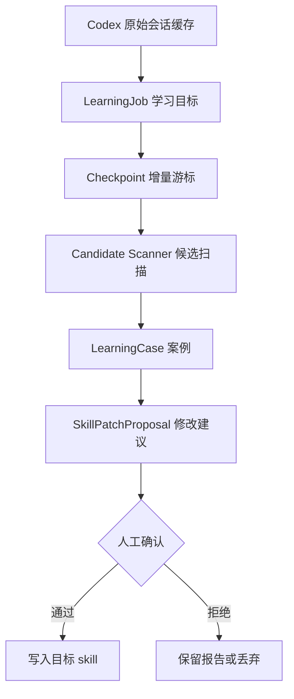

# AI 学习任务架构设计

## 背景与目标

旧 EvoMind 的方向是让系统从 Codex 历史会话中自动发现可沉淀的经验，再生成案例和规则建议。这个方向的问题是边界过宽：系统既要判断“学什么”，又要判断“怎么学”，还要决定“写到哪里”。当聊天数据里同时包含真实业务会话和分析器自身讨论时，容易出现误召回、重复扫描、成本不可控和自我吞噬。

新的方向是把“学习目标”显式化：由用户人工指定要学习的层面，系统只在这个边界内做增量扫描、案例提取和 skill patch 建议。自动化任务负责定期更新候选报告，不直接改 skill。

目标：

- 每个学习器都有清晰主题，例如 UI 审美、API 命名、服务验证或项目结构。
- 学习器按时间增量处理 Codex 原始会话，不反复暴力扫描全部历史。
- 原始会话和派生分析产物严格分层，默认不把分析器自己的输出当学习素材。
- Codex 自动化默认只生成报告和 patch 建议，人工确认后才写入 skill。
- 新学习器通过 Codex automation 显式创建和启停，不注册为 CodeYun 后台作业。

## 总体设计

## 模块边界

### Codex 原始层

职责：

- 表示真实 Codex 会话、消息、turn、时间、项目路径和来源设备。
- 提供按时间、项目、关键词和 thread 查询的基础能力。
- 记录文件签名和缓存刷新状态。

不负责：

- 判断案例是否值得学习。
- 生成规则。
- 修改 skill。

### LearningJob

职责：

- 定义学习目标。
- 定义输入范围，例如项目、路径、关键词、时间窗口。
- 定义排除规则，例如排除学习器自身、旧 EvoMind 讨论、分析报告。
- 指定目标产物，例如某个 skill、AGENTS.md 或 docs。
- 指定运行模式，v1 固定为 `propose_only`。

不负责：

- 保存完整原始聊天全文。
- 直接执行 skill 写入。

### Codex Automation

职责：

- 承载需要 AI 推理能力的定期学习任务。
- 读取 CodeYun 暴露的 Codex 原始会话总汇和本地 skill 文件。
- 按 LearningJob 的边界增量扫描、归纳和生成 patch 建议。
- 将运行报告写入数据目录或 docs 中约定的位置。

不负责：

- 作为 CodeYun 后端常驻作业运行。
- 绕过人工确认直接修改 skill。
- 默认消费自身产生的报告。

### Checkpoint

职责：

- 记录每个学习器的增量进度。
- 至少包含 `last_thread_updated_at` 和同时间戳下已处理的 thread id。
- 后续可扩展为 turn 级 cursor、内容 hash、规则 hash、prompt hash。

不负责：

- 表达学习结果。
- 替代扫描缓存。

### Candidate Scanner

职责：

- 只在 LearningJob 指定范围内扫描。
- 从原始会话中提取候选案例。
- 输出结构化 LearningCase。
- 应用自消费过滤规则。

不负责：

- 直接决定 skill 最终文本。
- 自动扩大到其他学习层面。

### SkillPatchProposal

职责：

- 汇总本次新增案例。
- 给出建议写入目标、规则正文、来源证据和风险边界。
- 作为人工审核材料保存。

不负责：

- 自动覆盖文件。
- 自动删除旧规则。

## 数据分层

学习系统必须区分来源层级：

- `raw_codex_session`：真实用户和 Codex 的一级原始会话。
- `learning_case`：学习器从原始会话提取的案例。
- `skill_patch_proposal`：学习器生成的修改建议。
- `activation_record`：人工确认后实际写入 skill 的记录。

默认规则：

- 学习器只消费 `raw_codex_session`。
- 学习器不消费 `learning_case`、`skill_patch_proposal`、`activation_record`。
- 如果未来需要让一个学习器学习另一个学习器的结果，必须显式开启，并记录派生链。

## UI 自主学习 v1

首个落地学习器是 `UI 自主学习`。

学习目标：

- 从 Codex 原始会话中捕捉用户对前端 UI、布局、审美、信息密度、控件边界的纠正。
- 生成面向 `D:/home/chenkunze/slns/skills/前端UI规范/SKILL.md` 的 patch 建议。
- 不直接修改 skill。

Codex 自动化：

- automation 名称：`UI 自主学习`
- 建议调度：每天 `03:10`
- 运行环境：Codex cron automation，工作目录为 `D:/home/chenkunze/slns/codeyun`
- 输入：CodeYun 的 Codex 会话缓存、目标 skill、上次 checkpoint。
- 输出：学习报告和 `前端UI规范` skill patch 建议。
- 写入策略：默认只写报告和建议，不直接修改 skill；需要人工确认后再执行写入。

v1 扫描策略：

- 读取 Codex 会话总汇或 `/cluster/codex` 背后的原始会话缓存。
- 按 `updated_at` 升序处理 checkpoint 之后的 thread。
- 对消息应用 UI 关键词和用户纠正关键词。
- 排除包含 EvoMind、自主学习、学习器、案例池等元学习语境且没有具体 UI 信号的内容。
- 每次运行更新 checkpoint。

v1 有意不做：

- 不写入 `SKILL.md`。
- 不做跨主题自动发现。
- 不消费学习器自己的报告。
- 不作为 CodeYun 后端作业类型注册。

## 正交性分析

这个方案把几个变化点拆开：

- 学习主题由 LearningJob 定义，新增 API 学习器不会影响 UI 学习器。
- 增量进度由 Checkpoint 管理，扫描规则变化不需要改 Codex 原始缓存。
- 案例提取和 skill 激活分离，Codex automation 失败不会污染 skill。
- 原始数据和派生数据分层，分析器不会默认学习自己的分析过程。
- CodeYun 负责提供数据底座，Codex automation 负责需要 AI 能力的学习推理，两者不混在同一个后端作业里。

相比旧 EvoMind，这个方案牺牲了“自动发现一切”的野心，但换来更低误伤、更低成本和更明确的人工控制点。

## 后续实施计划

1. 创建 `UI 自主学习` Codex automation，并先以报告模式运行。
2. 为 LearningJob 增加可配置输入，而不是把关键词写死在 CodeYun 后端代码里。
3. 增加 `rule_hash` 和 `prompt_hash`，规则变化后允许局部重扫。
4. 增加人工审核页面，展示报告、来源案例和 patch 建议。
5. 增加激活记录，确认后再写入 skill，并保留回滚依据。
