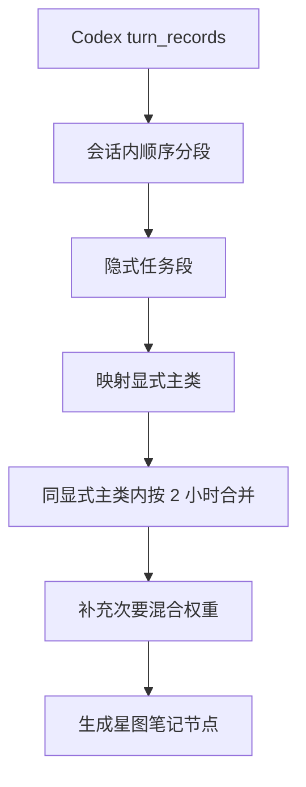

# Codex 日记分类聚合设计

## 背景与目标

Codex 日记导入的旧逻辑容易把“混合类别”误用成碎片聚合依据：只要多个消息共同命中若干星图类别，就可能被合成一个混合节点。这样会导致两个问题：

- 不相关任务被揉在一起，例如 PDF、DPI 截图、日记导入等只因为同属 CodeYun 语境而合并。
- 混合标签失去语义，变成“碎片桶”的解释，而不是表达一个原子任务确实跨多个性质。

新的目标是把“任务是否同一件事”和“最终星图类别是什么”解耦：

- 先按 Codex 原始会话/消息结构形成不可拆分任务段。
- 再将任务段归一化到允许自动分类的星图显式类。
- 最后只在同一显式主类内按 2 小时基准合并。
- 混合类别只作为最终节点的次要权重，不参与任务段聚合。

## 总体设计

### 正交性分析

- **会话分段**只回答“哪些消息属于同一个不可拆分任务段”，不直接决定星图类别。
- **显式类映射**只回答“这个任务段最适合哪个星图预设类别”，候选集由工程过滤后提供。
- **时间合并**只在显式主类相同的任务段之间运行，不读取混合权重。
- **混合权重**只描述最终节点的次要性质，不允许反向影响分段和合并。

这四层职责独立，后续调整某一层规则时，不需要同时改动其它层。

## 核心概念

### 消息/轮次

当前后端的最小输入单元是 `turn_records`，可视为“用户消息 + 对应助手结果”的一轮。它是日记导入里最小的不可拆分工程单元。

### 隐式任务段

由连续轮次聚合形成，表达内容中自然浮现的任务主题，例如：

- PDF 阅读器
- 行为树
- DPI 截图适配
- 问卷采集

隐式任务段不要求存在于星图类别配置中。

### 显式星图类别

显式类来自星图笔记类别配置，并且必须通过自动分类过滤。被用户移除或明确不作为类别的项目，不进入候选集，也不写入提示词。

### 混合次要类

最终节点可以有次要类权重，但主类必须占主导地位。混合权重用于表达“这个原子任务确实涉及多个性质”，不用于碎片聚合。

## 详细规则

### 1. 会话内优先分段

按 `thread_id` 与时间顺序读取轮次。默认同一会话内连续轮次属于同一隐式任务段。

当出现以下情况时，可以在同一会话内切段：

- 显式主类发生强切换，例如上一段明显是考勤，下一轮明显是凡修。
- 主题锚点完全断开，并且新轮次有足够强的新主题信号。
- 会话中途临时插入另一大类任务，后续又回到原任务时按新的连续段处理。

### 2. 显式类候选集工程过滤

候选星图类别只来自 `_filter_note_auto_classification_category_items` 的结果。被屏蔽类别不会参与打分、标题 hint 或 AI 提示。

### 3. 按显式主类合并

任务段完成显式类映射后，最终节点聚合只允许发生在同一显式主类内。

显式主类相同只是必要条件，不是充分条件。两个任务段还需要有共享的隐式主题锚点，才允许进入同一个最终节点；否则即使都属于同一显式类，也要保留为独立节点，避免退化成同类碎片桶。

合并目标时长为 2 小时。进度表达式由合并后总时长生成，例如 37 分钟为 `37/120`。

### 4. 次要类补充

当前先关闭混合次要类，最终节点只写显式主类 `100`。这是为了先验证分段和主类聚合是否稳定，避免混合权重继续被误读成碎片聚合结果。

后续如果重新开启混合次要类，最终节点的 `note_categories` 应基于合并后的内容重新计算，并保持主类主导：

- 主类至少占 60。
- 次要类只保留有效显式类，不保留 `general`。
- 次要类用于表达关联性质，不得改变 `primary_category`。

## 实施计划

1. 重构 `_build_codex_diary_blocks`，把“全局 topic 分组”拆成“会话内任务段”和“显式类内合并”。
2. 保留现有类别候选过滤逻辑，确保隐式/已屏蔽标签不会进入显式类候选集。
3. 调整混合权重计算，让它只在最终 block 上运行，并强制主类占主导。
4. 增加测试覆盖：
   - 同一会话内默认聚合。
   - 同一会话中显式主类强切换会拆段。
   - 不同会话同显式主类可按 2 小时合并。
   - 不同显式主类不能合并。
   - 同显式主类但隐式主题无关时不能合并。
   - 混合次要类不改变主类。
