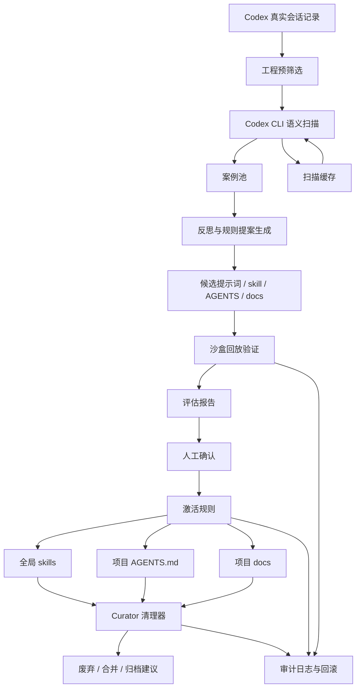
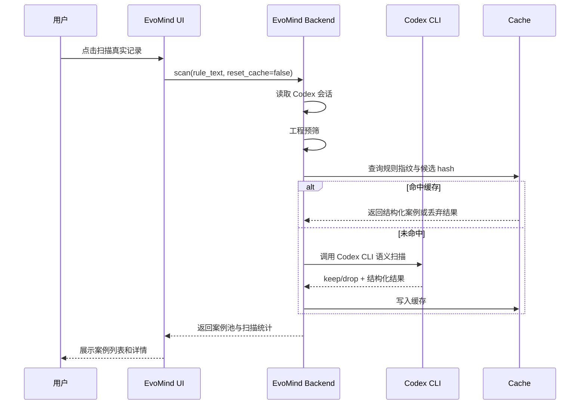
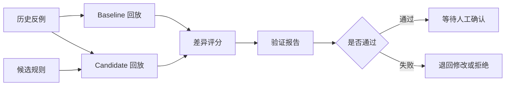

# EvoMind 自发觉自迭代机制设计

## 1. 背景

EvoMind 的目标不是让 AI “凭感觉”改提示词，而是把用户和 Codex 长期协作中反复出现的有效经验，沉淀为可复用、可验证、可回滚的工程资产。

当前最有价值的素材通常来自真实操作链路：

- 用户反复纠正同一类问题，例如“UI 过度包装、不够简洁优雅”。
- AI 初始方案和用户最终改出的方案之间存在稳定差距。
- 用户明显生气、骂人、高摩擦，说明当前规则缺失或执行失败。
- 用户明确标记“这里可以作为 EvoMind 样例学习”。
- 某次真实业务操作中，用户给出了具体修正路径，而不是抽象口号。

因此 EvoMind 的核心闭环是：

1. 从 Codex 真实聊天记录中捕捉高价值案例。
2. 用 Codex CLI 做语义筛选和结构化提炼。
3. 生成候选提示词、skill、AGENTS.md 或 docs 优化建议。
4. 在沙盒中用历史反例做 A/B 回放验证。
5. 人工确认后激活规则，并记录版本、效果和回滚路径。
6. 定期清理低频、错误、收益不明确或被新规则覆盖的 skill。

## 2. 外部实现调研

### 2.1 Hermes

Hermes 是 Nous Research 的自改进代码生成代理。它的关键机制包括：

- 从成功轨迹自动生成 skill。
- 持久化记忆，记录会话、任务结果、决策和用户偏好。
- 用 Curator 持续审查 skill 库，发现低效、过期或重复技能，避免 skill 膨胀。
- 通过沙盒、权限控制、审计日志和敏感信息过滤降低风险。

EvoMind 可以借鉴 Hermes 的三个设计点：

- **轨迹优先**：优先从真实成功或失败轨迹中学习，而不是从抽象描述中学习。
- **skill 生命周期**：skill 不只有创建，还要有 active、deprecated、archived 等状态。
- **Curator 角色**：需要专门的清理器审查低频、失效、互相冲突的规则。

参考：

- [Hermes Overview](https://hermes-agent.nousresearch.com/docs/intro)
- [Hermes Memory](https://hermes-agent.nousresearch.com/docs/user-guide/features/memory)
- [Hermes Skills](https://hermes-agent.nousresearch.com/docs/user-guide/features/skills)
- [Hermes Curator](https://hermes-agent.nousresearch.com/docs/user-guide/features/curator)
- [Hermes Security](https://hermes-agent.nousresearch.com/docs/user-guide/security)

### 2.2 Reflexion

Reflexion 的核心是让语言智能体通过语言反馈强化自身，不更新模型权重，而是把反思文本写入情景记忆，在后续任务中复用。

EvoMind 的对应启发：

- 案例卡不应只保存“用户骂了什么”，还要保存“AI 应该反思出的可迁移规则”。
- 反思必须绑定具体任务、上下文和失败点，否则会退化成空泛方法论。
- 反思文本需要进入可检索、可评估的记忆库，而不是散落在聊天记录里。

参考：[Reflexion: Language Agents with Verbal Reinforcement Learning](https://arxiv.org/abs/2303.11366)

### 2.3 Self-Refine

Self-Refine 使用同一个大模型完成“生成、反馈、改进”的迭代，不依赖额外训练数据。它证明了自然语言反馈可以作为一种通用的局部优化信号。

EvoMind 的对应启发：

- 每条案例可以拆成 `初始输出 -> 用户反馈 -> 改进输出 -> 可抽象规则`。
- 生成候选规则后，应先让模型自评该规则是否过宽、过窄、冲突或不可执行。
- 自评不能替代验证，只能作为进入沙盒验证前的低成本过滤。

参考：[Self-Refine: Iterative Refinement with Self-Feedback](https://arxiv.org/abs/2303.17651)

### 2.4 Voyager

Voyager 是 Minecraft 场景中的终身学习智能体，核心由自动课程、技能库和环境反馈迭代组成。它特别强调把已经学会的行为沉淀成可复用技能，并在新任务中组合调用。

EvoMind 的对应启发：

- skill 应该支持组合，而不是每个案例都生成孤立规则。
- 任务难度可以分层：先学习高频低风险偏好，再进入复杂项目级工作流。
- 需要记录 skill 的使用次数、命中场景和效果，而不是只记录文件内容。

参考：

- [Voyager Project](https://voyager.minedojo.org/)
- [Voyager GitHub](https://github.com/MineDojo/Voyager)

### 2.5 GEPA

GEPA 通过对执行轨迹和文本反馈做反思来进化提示词，并使用候选选择机制保留更优提示。它适合 EvoMind 的“提示词进化”部分。

EvoMind 的对应启发：

- 提示词优化不应该只生成一个新版本，而应保留多个候选并做对比。
- 验证不能只看单个分数，要看多目标结果，例如质量、简洁性、风险、token 成本、是否过拟合。
- 需要 Pareto 式选择：有些候选更简洁，有些候选更稳，不能只用单一指标粗暴淘汰。

参考：

- [GEPA paper](https://arxiv.org/abs/2507.19457)
- [DSPy Optimizers: GEPA](https://dspy.ai/learn/optimization/optimizers/)

### 2.6 OpenHands Microagents

OpenHands 的 microagents 是面向仓库、任务或领域的可触发提示单元。它说明了一个重要方向：知识不一定都要塞进全局系统提示，应该按场景触发。

EvoMind 的对应启发：

- 项目级经验应优先写入项目 `AGENTS.md` 或项目 docs。
- 跨项目稳定偏好才适合升级为全局 skill。
- 每条规则需要有触发条件，否则会让上下文越来越臃肿。

参考：

- [OpenHands Microagents Overview](https://docs.all-hands.dev/modules/usage/prompting/microagents-overview)
- [OpenHands Repository Microagents](https://docs.all-hands.dev/modules/usage/prompting/microagents-repo)

## 3. 设计原则

### 3.1 轨迹优先

EvoMind 优先学习真实业务操作，而不是抽象口号。

低价值素材：

- 用户单独说“要简洁优雅”。
- 没有前后对比的纯观点。
- 无法定位到具体 AI 初始错误和用户修正路径的抱怨。

高价值素材：

- 同一任务中存在 AI 初始输出、用户纠正、最终可接受结果。
- 用户指出了具体错误，例如“你只是把右栏字体调小，整体密度没有真正优化”。
- 用户把真实改法讲清楚，能反推通用判断规则。

### 3.2 人工触发，高消耗可见

EvoMind 扫描和验证会消耗大量 token 与算力，因此默认不自动运行。

要求：

- 扫描必须由用户手动触发。
- UI 显示扫描范围、命中数量、缓存命中、Codex CLI 调用次数和规则指纹。
- 已扫描且规则未变化的内容走缓存。
- 规则变化后允许一键重置缓存并全量重扫。

### 3.3 可验证优先于可生成

EvoMind 不能只会生成 skill，还必须能回答：

- 这条规则解决了哪个真实失败案例？
- 在同样上下文下，新规则是否能更短路径达到用户最终要求？
- 是否引入了新的副作用？
- 是否只是把一个局部偏好过度泛化？

### 3.4 生命周期管理

skill、提示词、AGENTS.md 片段和 docs 片段都应有生命周期。

建议状态：

- `draft`：候选，尚未验证。
- `validated`：沙盒验证通过，等待人工确认。
- `active`：已启用。
- `deprecated`：已被替代，不再推荐。
- `archived`：历史留存，默认不参与检索和触发。
- `rejected`：验证失败或人工否决。

### 3.5 场景化触发

经验沉淀分三层：

- 全局 skill：跨项目稳定成立的用户偏好或工作法。
- 项目 `AGENTS.md`：只对某个仓库成立的工程约定。
- 项目 docs：复杂业务机制、架构知识、历史决策。

EvoMind 不应把所有东西都升级成全局 skill。

## 4. 总体架构



## 5. 核心模块

### 5.1 Source Collector

负责读取 Codex 真实会话记录，并转换为统一候选输入。

职责：

- 扫描本机 Codex 会话目录。
- 提取用户请求、AI 回复、时间、项目路径、会话 id。
- 做敏感信息初步过滤。
- 保留可回溯来源，但 UI 默认只展示必要上下文。

不负责：

- 判断案例是否值得学习。
- 生成 skill。
- 修改任何规则文件。

### 5.2 Candidate Retriever

负责用工程规则做高召回预筛。

典型信号：

- 情绪或高摩擦：生气、骂人、反复强调、你怎么又、不是这个意思。
- 显式学习标记：EvoMind、AI请学习、这个可以作为案例。
- 前后对比：一开始、后来、最终、改成、不要这样。
- UI/工程高频偏好：简洁、优雅、冗余、臃肿、低频、删除、合并。

设计要点：

- 工程预筛只负责减少候选量，不能替代语义判断。
- 预筛宁可多召回，也不要漏掉高价值案例。
- 预筛规则进入规则指纹，变化后缓存自动失效。

### 5.3 Semantic Case Scanner

负责调用 Codex CLI 做深度语义判断。

输入：

- 候选会话片段。
- 当前案例捕捉规则。
- 项目上下文摘要。

输出：

- 是否保留。
- 案例标题。
- 领域。
- 信号类型。
- 强度等级。
- 原始请求。
- AI 初始问题。
- 用户纠正。
- 最终范式。
- 可迁移规则。
- 不应泛化的边界。

关键约束：

- 必须优先捕捉真实业务操作案例。
- 纯语言说明默认降权。
- 没有前后对比的抽象偏好默认不入池。
- 用户明确标记可学习时可以提高权重，但仍需结构化验证。

### 5.4 Rule Fingerprint 与扫描缓存

扫描缓存是 EvoMind 可用性的关键。

缓存 key 应包含：

- 候选来源 id。
- 候选文本内容 hash。
- 扫描规则 hash。
- Codex CLI 语义扫描 prompt hash。
- 工程预筛规则版本。
- EvoMind 结构化 schema 版本。

规则：

- 同一候选、同一规则、同一 schema 命中缓存。
- 规则变更后，旧缓存不复用。
- 用户可以手动清空缓存。
- UI 必须展示 cache hit/miss，让高消耗可见。

### 5.5 Case Pool

案例池是 EvoMind 的学习素材中心。

案例卡最小字段：

```json
{
  "id": "case_xxx",
  "title": "敏感信息命中合并展示",
  "domain": "codeyun/frontend",
  "signal": "用户纠正/高摩擦",
  "severity": "P0",
  "source": {
    "session_id": "...",
    "turn_ids": ["..."],
    "timestamp": "..."
  },
  "material": {
    "original_request": "...",
    "initial_ai_problem": "...",
    "user_correction": "...",
    "final_pattern": "..."
  },
  "reflection": {
    "failure_mode": "...",
    "transferable_rule": "...",
    "scope": "...",
    "anti_scope": "..."
  },
  "status": "candidate"
}
```

UI 展示要求：

- 左侧展示案例列表。
- 右侧展示选中案例详情。
- 详情中按“原始请求 / AI 初始问题 / 用户纠正 / 最终范式”分块。
- 不把所有素材堆成长文本。
- 支持从案例生成提案。

### 5.6 Reflection Synthesizer

负责把案例池中的一个或多个案例合成为规则提案。

输入：

- 单个案例。
- 同主题案例聚类。
- 当前已有 skill、AGENTS.md、docs 片段。

输出：

- 新增规则建议。
- 修改规则建议。
- 合并规则建议。
- 删除或废弃建议。

提案必须包含：

- 解决的案例列表。
- 建议写入位置。
- 触发条件。
- 规则正文。
- 反例边界。
- 预期收益。
- 潜在副作用。
- 验证方案。

### 5.7 Sandbox Evaluator

负责验证规则是否真的有效。

核心思想：

- 用历史反例作为测试集。
- 在相同或近似上下文下跑 baseline。
- 再加载候选规则跑 candidate。
- 比较是否更短路径达到用户最终要求。

验证输入：

- 历史原始用户请求。
- 当时相关上下文。
- 候选规则。
- 目标最终范式。
- 评分 rubrics。

验证输出：

- baseline 输出。
- candidate 输出。
- 差异解释。
- 是否更贴近最终范式。
- 是否减少迭代轮次。
- 是否引入副作用。
- token 和耗时成本。

建议评分维度：

- `task_success`：是否完成任务。
- `user_preference_alignment`：是否贴合用户稳定偏好。
- `specificity`：是否基于具体上下文，而不是空泛套话。
- `simplicity`：是否减少冗余和复杂度。
- `regression_risk`：是否破坏已有约定。
- `cost`：token、时间、工具调用成本。

### 5.8 Rule Registry

负责管理 EvoMind 当前所有提示词、扫描规则、验证规则和激活规则。

要求：

- 管理界面可查看全部提示词。
- 用户可开启、关闭、编辑、重置。
- 每条规则有版本、hash、修改时间、来源案例。
- 改动规则后影响缓存指纹。
- 支持导出和回滚。

### 5.9 Activator

负责把验证通过并经人工确认的提案写入目标位置。

目标位置：

- 全局 skill：`D:/home/chenkunze/slns/skills/.../SKILL.md`
- 项目规则：仓库 `AGENTS.md`
- 项目文档：仓库 `docs/*.md`
- EvoMind 内部提示词注册表

约束：

- 不自动覆盖用户未确认的文件。
- 每次写入必须有 diff。
- 写入后记录审计日志。
- 支持回滚到上一版本。

### 5.10 Curator

负责长期维护规则库质量。

检查项：

- 长期未命中的 skill。
- 命中后效果差的 skill。
- 与新规则冲突的旧规则。
- 重复表达的规则。
- 过宽、过窄或已经过时的规则。

输出：

- 合并建议。
- 废弃建议。
- 归档建议。
- 需要补案例验证的规则。

Curator 只生成建议，不直接删除。

## 6. 关键工作流

### 6.1 手动扫描真实记录



### 6.2 规则变更后的重扫

1. 用户在管理界面修改案例捕捉规则。
2. EvoMind 计算新的规则 hash。
3. 旧缓存不再命中。
4. 用户点击“重置缓存并重扫”。
5. EvoMind 全量重新调用语义扫描。
6. UI 展示新旧规则指纹和命中数量变化。

### 6.3 从案例生成规则提案

1. 用户选中一个或多个案例。
2. EvoMind 聚合同类案例。
3. Reflection Synthesizer 生成候选规则。
4. EvoMind 判断写入位置：skill、AGENTS.md、docs 或内部提示词。
5. 生成验证计划。
6. 提案进入 `draft` 状态。

### 6.4 沙盒验证



验证要尽量复现当时的用户提问模式，而不是把最终答案直接泄漏给 candidate。

### 6.5 激活与回滚

1. 用户查看验证报告。
2. 用户确认激活。
3. Activator 生成文件 diff。
4. 用户确认写入。
5. EvoMind 记录审计日志。
6. 后续若验证失败或用户不满意，可以回滚。

## 7. 验证设计

### 7.1 为什么需要沙盒

提示词优化很容易出现“看起来更合理，但实际没用”的问题。EvoMind 必须用历史失败案例验证候选规则是否真的减少用户工作量。

沙盒验证不是要证明规则永远正确，而是回答几个具体问题：

- 同样输入下，新规则是否更接近用户最终接受的方向？
- 是否减少用户需要再次解释的点？
- 是否出现明显新错误？
- 是否把局部偏好错误推广到其他场景？

### 7.2 Baseline 与 Candidate

Baseline：

- 不加载候选规则。
- 尽量使用当时类似上下文。
- 产出一版初始回答或修改方案。

Candidate：

- 加载候选规则。
- 输入保持一致。
- 产出一版回答或修改方案。

评估：

- LLM 评分。
- 规则匹配检查。
- 人工抽检。
- 与最终范式的结构化差异对比。

### 7.3 防止过拟合

候选规则不能只在原始案例上通过，还需要最少经过两类检查：

- **正例回放**：能修复原始失败案例。
- **邻近反例**：在类似但不相同的任务中不乱套规则。

例如：

- “UI 要简洁优雅”不能变成所有页面都极简到缺功能。
- “不要把素材铺成长文本”不能变成所有复杂详情都强制拆成列表。
- “手动触发高消耗扫描”不能影响低成本实时 UI 状态刷新。

### 7.4 成功指标

短期指标：

- 真实案例捕捉准确率。
- 用户手动删除案例比例。
- 候选规则通过验证比例。
- 缓存命中率。
- 每次扫描 token 成本。

中期指标：

- 同类用户纠正次数下降。
- 高摩擦会话占比下降。
- skill 命中后的返工率下降。
- 低频 skill 清理数量。

长期指标：

- 用户明确重复强调的方法论减少。
- 新项目中 AGENTS.md 和 docs 的有效复用增加。
- EvoMind 推荐规则被用户接受比例提高。

## 8. 当前实现状态

当前最小闭环已经覆盖 P0 的一部分：

- 已接入 EvoMind 页面。
- 已删除 demo 样例，扫描真实 Codex 会话。
- 已支持 Codex CLI 语义扫描。
- 已支持人工触发扫描。
- 已支持规则指纹和扫描缓存。
- 已支持重置缓存并重扫。
- 已支持管理界面查看和编辑案例捕捉提示词。
- 已支持 Codex 风格的“左侧列表 + 右侧详情”案例素材展示。

当前仍缺：

- 规则提案生成。
- 沙盒 A/B 回放验证。
- skill / AGENTS.md / docs 写入前 diff 和确认。
- 规则生命周期管理。
- Curator 清理器。
- 审计日志与回滚。

## 9. 分阶段实施路线

### P0：真实案例捕捉闭环

目标：

- 从真实 Codex 记录中捕捉可学习案例。
- 用户能看到素材结构。
- 高消耗扫描手动触发。
- 扫描可缓存、可重置。

状态：已基本完成，后续继续改善案例质量。

### P1：规则提案层

目标：

- 从一个或多个案例生成候选规则。
- 自动判断写入层级：skill、AGENTS.md、docs 或 EvoMind 内部提示词。
- 提案必须包含触发条件、边界和验证计划。

建议新增：

- `RuleProposal` 数据结构。
- 提案列表 UI。
- “从选中案例生成提案”按钮。
- 已有规则冲突检测。

### P2：沙盒验证层

目标：

- 用 Codex CLI 对历史失败案例做 baseline/candidate 回放。
- 生成验证报告。
- 支持多候选对比。

建议新增：

- `EvaluationRun` 数据结构。
- `evomind evaluate` 后端接口。
- 沙盒工作目录。
- token 成本统计。
- 验证报告 UI。

### P3：激活与回滚层

目标：

- 人工确认后写入 skill、AGENTS.md 或 docs。
- 每次写入有 diff、审计日志和回滚记录。

建议新增：

- `ActivationPlan`。
- 文件补丁预览。
- 规则版本历史。
- 回滚按钮。

### P4：Curator 清理层

目标：

- 定期审查 skill 和规则库。
- 给出合并、废弃、归档建议。

建议新增：

- skill 使用统计。
- 命中效果反馈。
- 低频规则列表。
- 冲突规则检测。
- 清理提案 UI。

## 10. 数据结构草案

### 10.1 RuleProposal

```json
{
  "id": "proposal_xxx",
  "title": "前端素材详情使用结构化 inspector 展示",
  "source_case_ids": ["case_xxx"],
  "target": {
    "type": "skill",
    "path": "D:/home/chenkunze/slns/skills/前端UI规范/SKILL.md"
  },
  "trigger": "展示案例、日志、聊天记录、证据链等高信息密度素材时",
  "rule_text": "优先使用左侧列表 + 右侧选中详情的 inspector 结构...",
  "scope": "前端 UI 信息架构",
  "anti_scope": "简单表单、单条短文本说明不需要强行拆 inspector",
  "expected_gain": "减少用户对素材展示混乱的返工",
  "risk": "过度使用 inspector 可能让简单页面变复杂",
  "status": "draft"
}
```

### 10.2 EvaluationRun

```json
{
  "id": "eval_xxx",
  "proposal_id": "proposal_xxx",
  "case_ids": ["case_xxx"],
  "baseline": {
    "output": "...",
    "score": 0.42
  },
  "candidate": {
    "output": "...",
    "score": 0.81
  },
  "metrics": {
    "task_success": 0.8,
    "preference_alignment": 0.9,
    "simplicity": 0.85,
    "regression_risk": 0.2,
    "cost_tokens": 12000
  },
  "verdict": "pass",
  "notes": "candidate 更接近最终 inspector 结构，未发现明显副作用"
}
```

### 10.3 SkillLifecycle

```json
{
  "skill_id": "前端UI规范",
  "status": "active",
  "source_case_ids": ["case_xxx", "case_yyy"],
  "usage_count": 18,
  "success_count": 14,
  "last_used_at": "2026-05-12T10:00:00+08:00",
  "conflicts": [],
  "replacement": null
}
```

## 11. 风险与约束

### 11.1 隐私与敏感信息

Codex 会话可能包含密钥、服务器信息、客户数据或私人内容。

约束：

- 扫描前做敏感信息过滤。
- UI 默认展示必要片段，不展示完整日志。
- 调用 Codex CLI 前尽量裁剪上下文。
- 审计日志不记录完整敏感文本。

### 11.2 过度泛化

单个案例不能直接变成全局规则。

控制方式：

- 提案必须写明适用范围和反范围。
- 高影响规则需要多个案例支持。
- 沙盒必须包含邻近反例。

### 11.3 规则膨胀

如果每次用户纠正都创建 skill，系统会变得臃肿。

控制方式：

- 同主题案例先聚类。
- 优先更新已有 skill。
- Curator 定期合并和废弃。
- 低频规则不进入全局上下文。

### 11.4 验证幻觉

LLM 评分可能偏向自己生成的候选规则。

控制方式：

- baseline/candidate 输出分离。
- 评分 rubrics 固定。
- 引入结构化检查。
- 关键规则保留人工抽检。

### 11.5 成本失控

深度扫描和验证会消耗大量 token。

控制方式：

- 手动触发。
- 缓存。
- 展示成本。
- 支持扫描范围限制。
- 支持只扫描新增会话。

## 12. 工程边界

EvoMind 不应该变成一个直接自动修改全局规则的黑盒。

模块边界：

- Scanner 只产出案例。
- Synthesizer 只产出提案。
- Evaluator 只产出验证报告。
- Activator 只在用户确认后写入文件。
- Curator 只产出清理建议。

这条边界可以避免“扫描时顺手改 skill”“验证时顺手激活”“清理时顺手删除”等高风险耦合。

## 13. 下一步建议

优先实现 P1 和 P2：

1. 增加 `RuleProposal` 持久化和 UI。
2. 支持从选中案例生成提案。
3. 实现 Codex CLI 沙盒回放验证。
4. 验证报告展示 baseline/candidate 对比。
5. 通过人工确认后，再进入文件写入和生命周期管理。

这样 EvoMind 会从“会捕捉案例”进入“能证明规则有用”的阶段。
