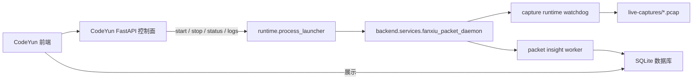

# 凡修抓包独立服务重构设计

## 背景

凡修邮件、储物袋、活动等图鉴数据依赖抓包解析链路。前端页面只展示数据库结果；如果抓包和解析没有持续写入数据库，页面会出现“当前时间已经很晚，但邮件只更新到很早时间”的现象。

旧实现把抓包 watchdog 和 packet insight worker 托管在 CodeYun 后端 FastAPI lifespan 内。这个边界不合理：

- CodeYun 后端重启、热更新、崩溃会影响抓包解析连续性。
- 服务页看到的是“后端进程里的线程状态”，不是独立服务事实。
- 控制面和数据面混在一起，容易出现启动了页面服务但实际没有解析的假运行。

## 目标

- 凡修抓包是独立长驻进程，不依赖 CodeYun 后端是否持续运行。
- CodeYun 只负责启动、停止、查看状态、查看日志，不在 FastAPI 进程内跑抓包解析线程。
- 抓包服务内部统一托管两件事：
  - `fanxiu_capture_runtime_service`：保证 tcpdump/capture runtime 可用。
  - `fanxiu_packet_insight_worker`：持续扫描 pcap、解析协议、同步数据库。
- Windows 下启动不能出现额外控制台窗口。

## 进程边界

## 当前落地

- 独立入口：`backend.services.fanxiu_packet_daemon`
- 运行时管理：`backend.core.fanxiu.packet.service_runtime`
- 状态文件：`<CODEYUN_DATA_DIR>/fanxiu/packet-insights/packet_service_state.json`
- 日志文件：`<CODEYUN_DATA_DIR>/logs/fanxiu-packet-service.log`
- 服务页 key 仍沿用 `fanxiu-capture-runtime`，但语义升级为“凡修抓包守护进程”。

## 启动约束

所有启动必须走 `backend.core.runtime.process_launcher`：

- 使用 `popen_python_module_service(...)` 启动 Python 模块。
- 守护进程入口先调用 `install_child_process_no_window_default()`。
- 不允许新增裸 `subprocess.Popen(...)` 或可见 `Start-Process` 来启动抓包相关服务。
- stdout/stderr 写入日志文件，不依赖控制台窗口。

## 控制面约定

- `/capture-runtime/status` 读取守护进程状态文件和进程列表。
- `/capture-runtime/ensure` 启动守护进程。
- `/capture-runtime/stop` 停止守护进程。
- `/packet-capture/tcp/worker/status` 只读守护进程中的 worker 状态。
- `/packet-capture/tcp/worker/realtime-scan` 和 `/maintenance` 不再在 FastAPI 进程内直接执行 worker，只委托为确保守护进程运行。

## 后续改进

- 给守护进程增加内部命令通道，用于精确触发一次 `scan_once` 或 `maintenance_once`。
- 服务页增加“状态更新时间过久”告警，例如超过 2 分钟未刷新视为异常。
- 邮件页增加数据新鲜度提示，区分“游戏没有产生邮件包”和“抓包服务没有解析”。
