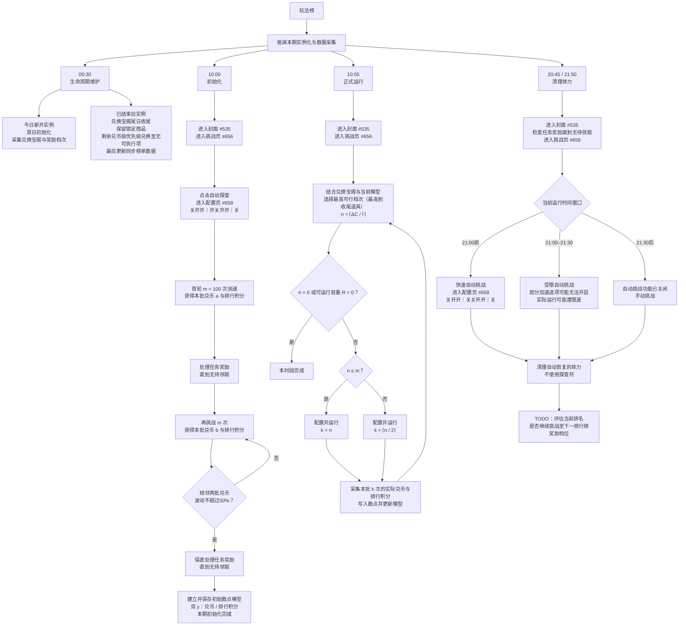
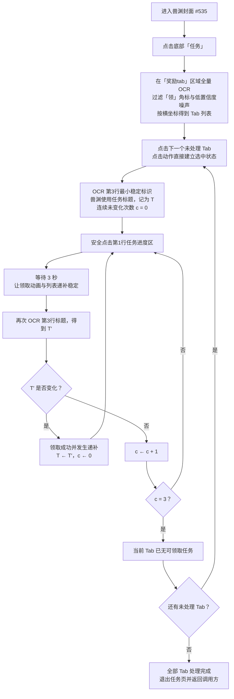

# 兽渊探秘规划架构

图中的开关串仅按当前界面从上到下简略展示状态；代码配置以稳定参数名到布尔值的键值映射为准，不依赖开关数量或顺序。

正式运行中的符号均为本期当前一轮规划值：

- `ΔC`：所选最高可行兑换档次尚缺的兽元；
- `r̂`：当前散点模型估计的平均每次探查兽元；
- `n = ⌈ΔC / r̂⌉`：达到该档次理论上还需运行的次数；
- `m = 100`：初始化测速批次大小，也是正式运行是否直接收尾的阈值；
- `k`：本批实际配置次数；当 `n ≤ m` 时 `k = n`，否则 `k = ⌈n / 2⌉`；
- `R`：当前资源能够支持的最大运行次数。规划档次时先要求 `n ≤ R`，若收尾道具不可达则依兑换优先级退到当前资源可达的最高档次。

其中 `n > m` 时只运行 50% 是滚动重规划的风险控制，不是单纯拆批。兽元收益会随层级和随机事件显著波动，一次性运行全部预测次数可能严重超出目标；每完成半批就采集真实双 y、更新散点模型并重算 `n`，用于逐步收敛目标。

## 兽渊任务奖励领取

本图是兽渊当前实机 UI 的定制流程，不作为其它 Task 的通用 UI 实现。可以复用的是“安全点击 + 稳定观测 + 连续无变化收尾”的思想；Tab 区、点击区和稳定观测区由各 Task 自己定义。该模块内部不执行挑战。

