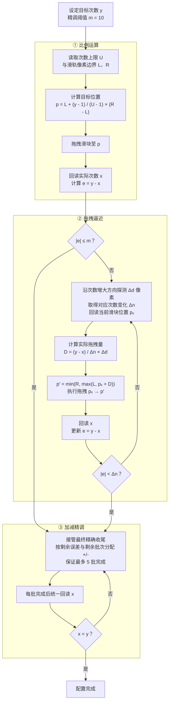

# 整数滑轨次数配置规划

```mermaid
flowchart TB
    START["设定目标次数 y<br/>精调阈值 m = 10"]

    subgraph P["① 比例运算"]
        P1["读取次数上限 U<br/>与滑轨像素边界 L、R"]
        P2["计算目标位置<br/>p = L + (y - 1) / (U - 1) × (R - L)"]
        P3["拖拽滑块至 p"]
        P4["回读实际次数 x<br/>计算 e = y - x"]

        P1 --> P2 --> P3 --> P4
    end

    subgraph D["② 拖拽逼近"]
        D1{"|e| ≤ m？"}
        D2["沿次数增大方向探测 Δd 像素<br/>取得对应次数变化 Δn<br/>回读当前滑块位置 pₓ"]
        D3["计算实际拖拽量<br/>D = (y - x) / Δn × Δd"]
        D4["p′ = min(R, max(L, pₓ + D))<br/>执行拖拽 pₓ → p′"]
        D5["回读 x<br/>更新 e = y - x"]
        D6{"|e| < Δn？"}

        D1 -->|否| D2 --> D3 --> D4 --> D5 --> D6
        D6 -->|否| D2
    end

    subgraph F["③ 加减精调"]
        F1["接管最终精确收尾<br/>按剩余误差与剩余批次分配 +/-<br/>保证最多 5 批完成"]
        F2["每批完成后统一回读 x"]
        F3{"x = y？"}

        F1 --> F2 --> F3
        F3 -->|否| F1
    end

    DONE["配置完成"]

    START --> P1
    P4 --> D1
    D1 -->|是| F1
    D6 -->|是| F1
    F3 -->|是| DONE
```
