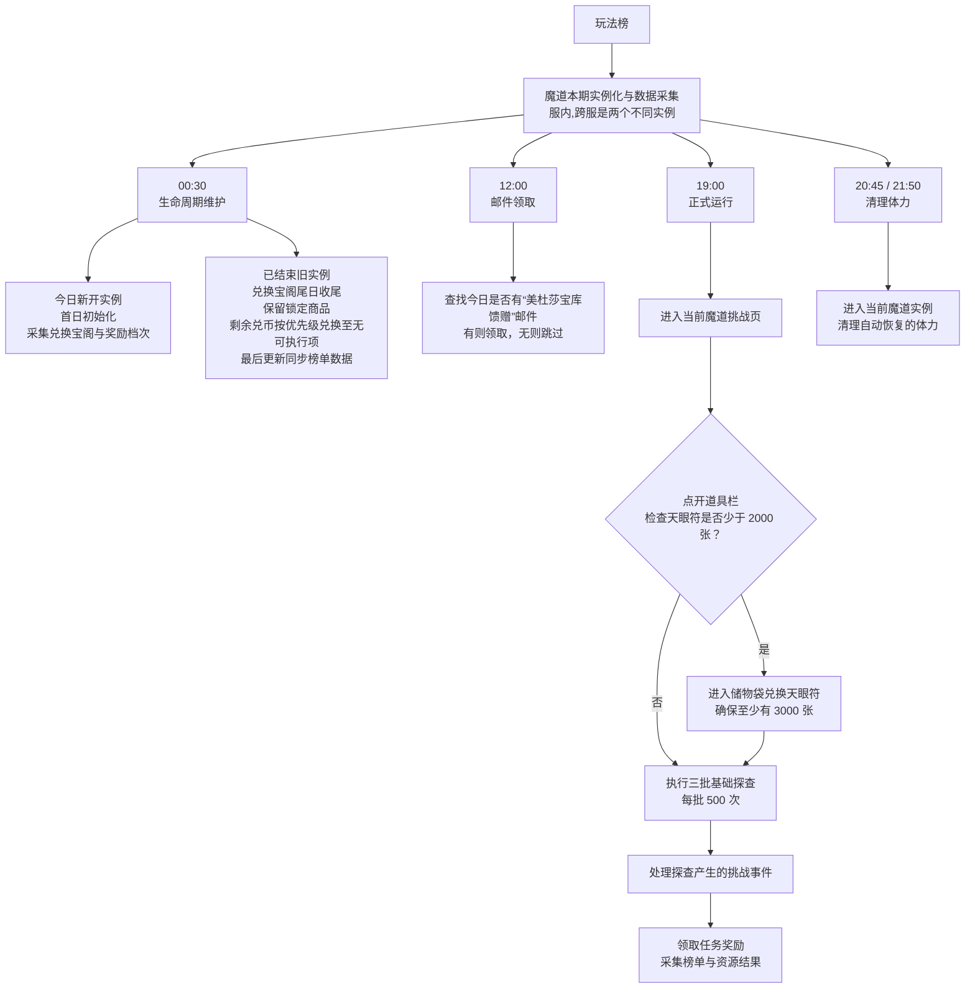

# 魔道入侵规划架构

> 本文描述魔道入侵自动化的理想完成态，是研发与验收使用的设计稿，不代表当前代码已经完整实现。

魔道入侵与兽渊探秘共用同一个玩法榜主体结构。魔道的主要差异只有两个：本期通常按“服内 → 跨服”连续形成两个独立实例，具体运行时使用魔道自己的玩法策略。

进入挑战页的接口内部兼容弹窗、普通大地图和天南大陆详情等可选过渡画面，不在主流程中展开。

图中的服内、跨服表示两个连续但独立的业务任务。通常服内结束后紧接跨服，但实际起止时间仍以运行时日程为准，不能依靠固定日期或固定间隔推算。

服内和跨服只是顺序执行的两个活动实例。两者不共享探查进度、任务奖励、排行榜、钱包、商店购买次数或完成状态，但主体流程完全相同。
