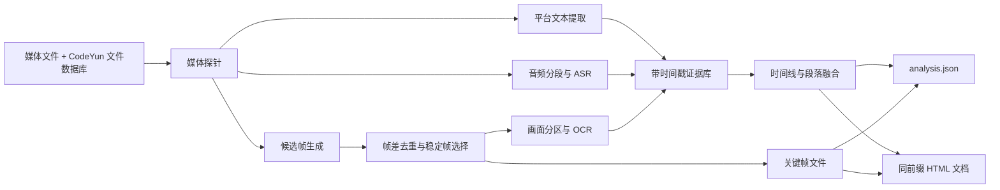

# 视频内容文档化解析设计

## 1. 背景与目标

视频下载只解决了媒体归档，下一层需求是把视频转换成可搜索、可引用、可反查的文档。这里的“内容识别”同时覆盖：

- 平台标题、简介、标签、章节和字幕；
- 音频中的讲话、旁白和歌词；
- 画面中的字幕、界面文字、幻灯片和滚动文档；
- 能代表内容变化的关键帧；
- 基于上述证据生成的结构化 Markdown 文档。

如果“拼音内容”指画面里真实出现的拼音字母，则由 OCR 的拉丁字符识别和中文词汇校正分支处理；如果指“视频/音频内容”，则主要由 ASR 与视觉 OCR 共同处理。

目标不是生成一篇看似合理的摘要，而是生成一份每个结论都能追溯到时间戳、关键帧或转写片段的证据型文档。

## 2. 真实样本结论

首个样本为 `BV1svKy6UEwu`：

- 时长约 30.72 秒，1080×1920、30 fps；
- B 站没有提供字幕、自动字幕或章节；
- 画面主体是 Windows 记事本中的攻略文本，叠加游戏画面和固定黄色宣传文字；
- FFmpeg 场景阈值检测得到 8 个候选画面变化，但正文长期不变；
- 2 秒间隔均匀采样得到 16 帧，其中多数正文高度重复；
- PP-OCRv5 对裁剪后的单帧识别出 72 个文本块，正文可读性较好；
- CPU 连续识别 5 帧约耗时 156 秒，而 8、16、24、30 秒的正文高度重复。

这个样本证明：

1. 全画面场景变化不等于内容变化。游戏特效会制造大量无价值关键帧。
2. 先 OCR 再去重会浪费大量算力。必须先用帧差、感知哈希和稳定性筛选减少候选。
3. 对滚动文档，应围绕文档视口选帧并拼接文本；对普通视频，才以镜头切换和语音段落为主。
4. 固定宣传字、台标和主播水印属于覆盖层，应单独识别并从正文候选中降权。

## 3. 总体设计



### 3.1 基础模型

系统只需要四个基础概念：

1. `SourceFact`：不可再生或需要长期保留的来源事实，如平台、原始 URL、视频 ID 和下载时间。
2. `Evidence`：从视频中提取的原始证据，如字幕片段、ASR 片段、OCR 文本块和关键帧。
3. `TimelineSegment`：把同一时间范围的多模态证据组合起来，但不做自由发挥。
4. `DocumentProjection`：面向人阅读的 Markdown，是可重新生成的派生结果。

来源事实进入 CodeYun 数据库，分析结果与来源事实分层保存。文件系统不再生成
零散的 `source.json`；`analysis.json` 作为可随算法升级重建的机器证据投影，
需要产品化时也应优先迁入数据库或统一派生快照，而不是无限增加 sidecar。

### 3.2 模块正交性

- 平台解析器只负责平台元数据和平台字幕，不依赖 OCR 或 ASR。
- 帧选择器只看视觉变化、清晰度和稳定性，不解释文字含义。
- OCR 只返回文本、坐标、置信度和帧时间，不直接写文章。
- ASR 只返回带时间戳的语音片段，不推断画面内容。
- 融合器只把相近时间的证据建立关联，不修改原始证据。
- 文档渲染器消费统一的 `analysis.json`，可独立更换模板。
- LLM 仅作为可选的整理器，不能成为唯一证据来源。

因此，更换 PaddleOCR、Whisper、镜头检测算法或文档模板时，不需要改动其他模块。

## 4. 详细设计

### 4.1 媒体探针

使用 FFprobe 读取：

- 时长、分辨率、帧率、码率和编码；
- 音视频轨、内嵌字幕轨和章节；
- 旋转信息与像素宽高比；
- 是否存在有效音频。

探针结果决定后续分支。没有音频时跳过 ASR；有内嵌字幕时优先提取字幕；竖屏视频使用竖屏采样参数。

### 4.2 平台文本

优先级从高到低：

1. 创作者上传字幕；
2. 平台自动字幕；
3. 内嵌字幕轨；
4. 标题、简介、标签和章节；
5. ASR；
6. 画面 OCR。

平台文本保留原语言、时间戳和来源类别，不能用标题直接替代正文。

### 4.3 音频内容

音频流水线建议采用：

1. FFmpeg 统一为 16 kHz 单声道 PCM；
2. VAD 删除长静音和纯音乐空段；
3. faster-whisper 生成分段文字、时间戳和语言；
4. 对专名使用标题、标签和 OCR 词汇表做受限纠错；
5. 保留纠错前文本、纠错后文本和置信度。

第一版不做说话人分离。只有访谈或多人会议视频才按需加入 diarization。

### 4.4 候选帧与关键帧

候选帧来自三条独立通道：

- 镜头通道：FFmpeg scene score 或 PySceneDetect；
- 时间通道：长镜头内按最大间隔补样；
- 文本通道：OCR 视口发生明显变化时补样。

候选生成后先做便宜筛选：

- 感知哈希去除近重复帧；
- 拉普拉斯方差排除模糊帧；
- 光流或相邻帧差排除滚动中的运动帧；
- 固定台标和覆盖层不参与内容差异计算；
- 对检测到的文档/幻灯片区域单独计算 ROI 差异。

关键帧评分可表示为：

`score = 内容增量 + 镜头变化 + 清晰度 + 停稳程度 - 重复度 - 覆盖层占比`

这不是一个固定权重模型。不同内容类型使用不同 profile：

- 普通叙事视频重视镜头变化；
- 教程重视界面状态变化；
- 幻灯片重视页面变化；
- 滚动文档重视新文本增量与停稳程度；
- 游戏视频同时保留少量战斗状态帧和文字证据帧。

### 4.5 画面分区与 OCR

先检测画面区域，再执行 OCR：

- `document`：白底文档、幻灯片、网页正文；
- `subtitle`：底部或顶部短句字幕；
- `ui`：游戏数值、按钮和状态栏；
- `overlay`：台标、主播宣传语和日期水印。

区域类别决定文本用途。`overlay` 可记录但默认不进入正文；`document` 进入文档拼接；`subtitle` 进入时间线；`ui` 作为状态证据。

OCR 输出必须包含：

- `text_raw`；
- `bbox`；
- `confidence`；
- `timestamp`；
- `region_type`；
- `frame_id`。

### 4.6 滚动文档拼接

滚动文档不能简单拼接每帧 OCR 文本。正确流程是：

1. 通过窗口边缘、背景颜色和文本密度定位文档视口；
2. 检测滚动开始与结束，只在画面停稳后 OCR；
3. 按文本行的纵坐标将 OCR token 重组为行；
4. 用行级模糊匹配寻找相邻帧的重叠区；
5. 只追加重叠区之后的新行；
6. 多次出现的同一行按置信度和清晰度投票；
7. 对被宣传字遮挡的行，等待其他滚动位置补全；
8. 无法补全的文字保留 `[识别不清]`，不猜写。

### 4.7 多模态融合

融合器按时间范围建立 `TimelineSegment`：

```json
{
  "start": 8.0,
  "end": 12.0,
  "speech_evidence_ids": [],
  "ocr_evidence_ids": ["ocr-008-01", "ocr-008-02"],
  "keyframe_ids": ["frame-008"],
  "summary": "展示炼虚至大乘通用功法书列表",
  "confidence": 0.96
}
```

`summary` 是投影，不是证据。任何摘要都必须保留引用 ID。

### 4.8 输出结构

每个视频建议产生：

- CodeYun 文件数据库：`DeviceFile` 保存文件事实，`MediaSyncSourceItem` 保存平台来源事实；
- `*.analysis.json`：机器可读证据、时间线、算法版本和置信度；
- `视频名.html`：与 `视频名.mp4` 同目录、同前缀的可播放结构化文档；
- `*.keyframes/`：被文档实际引用的少量关键帧。

HTML 默认结构：

1. 标题与来源；
2. 一句话摘要；
3. 主要内容；
4. 时间线；
5. OCR/字幕/语音整理稿；
6. 可点击时间点与关键帧；
7. 识别不确定项；
8. 技术元数据与生成版本。

HTML 通过相对路径引用同目录 MP4，不复制视频数据。页面内置原生
`<video controls>` 播放器，时间线按钮通过 `currentTime` 跳到证据对应位置。
文档不依赖远端脚本，即使离线打开也能阅读和播放。HTML 只是展示投影，
重新生成 HTML 不会修改数据库来源事实或 `analysis.json`。

## 5. 质量与安全边界

- 原始 OCR、ASR 与关键帧是证据层，只追加或版本化，不被摘要覆盖。
- 文档中区分“原文”“规范化文本”“模型总结”。
- 每个结论保存证据引用和置信度。
- 不因标题或标签推断视频没有展示的事实。
- 低置信度专名不得自动改写。
- 分析失败不影响原始 MP4 和数据库来源事实。
- 分析产物是可再生派生数据，不进入下载去重键。

## 6. 性能策略

按成本从低到高执行：

1. FFprobe 与平台元数据；
2. 低分辨率帧差、感知哈希和清晰度；
3. 少量候选帧 OCR；
4. VAD 后的 ASR；
5. 多模态融合与可选 LLM 整理。

若低成本阶段证明两帧内容相同，后续昂贵阶段必须跳过。OCR 服务应复用常驻模型；批处理不应为每帧重建模型。

## 7. 实施计划

### 阶段一：证据骨架

- 建立 `analysis.json` schema；
- FFprobe 探针；
- 均匀采样、场景候选和感知哈希去重；
- 关键帧落盘；
- 生成不含自由总结、可播放原视频的基础 HTML。

### 阶段二：画面文字

- 接入 PaddleOCR 常驻服务；
- 固定覆盖层检测；
- OCR token 行重建；
- 先实现滚动文档 profile；
- 用 `BV1svKy6UEwu` 做回归样本。

### 阶段三：音频语义

- 接入 VAD 和 faster-whisper；
- 建立专名词表与受限纠错；
- 输出带时间戳的语音证据。

### 阶段四：融合与产品化

- 生成时间线和 Markdown；
- 在视频查看页展示文档、关键帧和来源跳转；
- 支持重新分析、算法版本比较和失败重试；
- 将长视频分析改为后台派生任务，前端轮询增量快照。

## 8. 首个样本的验收口径

对 `BV1svKy6UEwu`，第一版应做到：

- 正确识别其为“滚动/静态文档叠加游戏画面”；
- 把宣传语与正文分开；
- 选出不超过 3 张正文关键帧和不超过 3 张游戏状态关键帧；
- 重建功法书列表与“平民自测四种顺序”段落；
- 每段正文能跳回对应时间点和关键帧；
- OCR 不确定处显式标注，不用语言模型猜补；
- 重复帧不重复执行 OCR。
