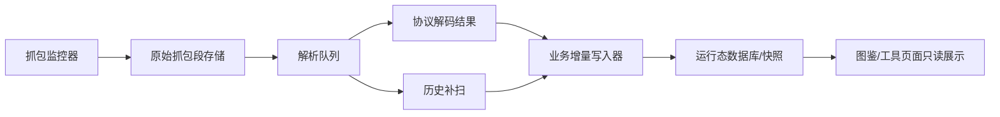

# 凡修抓包服务架构约定

本文是凡修抓包相关功能的架构入口。后续 agent 只要开发、修复或扩展凡修抓包能力，必须先读本文，再读 `docs/凡修运行态抓包观察事实层.md` 和 `docs/凡修逆向增量更新约定.md`。

## 背景与目标

凡修抓包不是图鉴页面的附属功能，也不是一次性脚本。它是一条持续运行的数据生产管线：



目标：

- 抓包监控器持续、按序、完整保存原始数据。
- 解析器按抓包序列升序消费，允许延迟，但不能跳包。
- 每个已探明业务域的解析结果都通过幂等的增量写入器落到数据库业务事实层。
- 图鉴、储物袋、活动页等前端只读取数据库查询接口，绝对禁止触发抓包、解码、补扫、同步或重建。
- 新解析规则发布后，必须能对历史抓包补扫，把过去漏掉的有效数据补回来。

这里的“业务域”指已经明确字段语义和用途的运行态数据，例如排行榜、玩家面板、储物袋、钱包资源、装备、玩法状态、拜谒记录等。JSON 文件可以作为调试快照、兼容产物或未知协议探索阶段的临时产物，但不能替代已探明业务域的数据库落库。

## 存储分层与清理

抓包数据必须区分“短期过程证据”和“长期业务事实”。

短期过程证据包括原始 pcap、明文 decoded JSON、meta.json、解析调试样本等。它们用于追溯、复查和补解析，不是业务读取的最终数据源。此类数据允许按时间和空间上限裁剪：默认至少保留最近一批证据，同时清理超过保留期或空间上限的旧记录。洞天、活动现场、当前人数、当前联盟、临时行动力等强时效状态，默认只需要进入这层通用抓包事实缓存；过期后没有必要为它们保留专用永久表。

通用明文包数据库表属于短期事实缓存：它保存协议名、协议号、时间、payload 和证据路径，供业务按“最近某类协议包”读取当前现场。业务侧可以在请求抓包服务追平后查询这张表，但不应因此为每个短期玩法都新建专属持久表。抓包服务在强制追平和维护补扫后会自动尝试裁剪这张表；裁剪失败只记录错误，不应影响本次最新事实读取。

业务代码需要“确保当前抓包已追平并读取最新明文包”时，应优先使用组合入口：先请求抓包服务追平，再查询通用 decoded 表。调用方只传协议名、协议号、时间窗口和数量限制，不写具体玩法的抓包解析逻辑。

组合入口只有在服务明确确认本轮封口、解码和入库完成后才返回记录，并以 `facts_ready=true` 表达这一业务事实。若追平 pending、超时或失败，返回空记录与 `facts_ready=false`；不得顺手回读旧缓存伪装成此次结果。需要容忍旧数据的诊断工具必须显式调用独立只读查询。

行为树调用抓包服务只读取顶层业务投影：采集前检查 `capture_ready`，追平后检查 `facts_ready`，诊断时可看 `service_status`。通用命令信封、结果文件路径、worker 阶段和原始抓包详情可以保留给运维接口，但业务任务不得遍历多层 `result.result` 推断内部状态。

长期业务事实包括邮件记录、图鉴资料、账号画像、玩家面板、活动排行等业务需要持续查询、去重、审计或展示的数据。这类数据必须通过幂等写入器进入数据库业务表或统一事实表，不能依赖 decoded JSON 长期存在。清理原始包和 decoded JSON 时，不得把已经入库的业务事实一起删除；业务事实是否过期，由对应业务自己的规则决定。

判断规则：

- “以后还要长期查这条业务记录”：写业务表或统一事实表。
- “只需要当前现场最新状态”：写通用抓包事实缓存，按时间和空间清理。
- “只是为了复查解析对不对”：保留 pcap/JSON 证据，允许过期裁剪。
- “还没探明业务意义”：先留在通用 decoded 记录里，不急着建专表。

## 模块边界

## 两套调度体系

凡修抓包服务应明确分成两套调度体系。它们可以共用同一套解码器和业务写入器，但目标、入口、时间预算和失败处理不同，不能混成一个“页面刷新时顺手同步”的副作用。

### 实时体系

实时体系负责正在发生的数据，目标是低延迟、可中断、可快速失败。

典型场景：

- 抓包服务持续保存正在产生的 live pcap。
- 行为树打开邮件、背包或面板后，需要尽快 flush 当前短 pcap，并尝试解析刚发生的数据。
- 应急 API 只针对指定的当前 pcap 或短时间窗口做解析，不扫描全量历史。

约束：

- 优先保证最新事实尽快入库，但不能把未确认缺口伪装成已完成。
- 单次调用必须有明确时间预算，坏包、半包、协议缺口只能形成可见错误，不得卡死行为树。
- 实时体系只推进 `latest_scanned_*`；遇到失败洞时，`confirmed_cursor_*` 不得跨过去。
- 实时 API 可以触发“收口当前段、解码当前段、写入当前批事实”，但不能做全量重建或历史补扫。

### 整理体系

整理体系负责历史完整性，目标是无遗漏、可重试、可回补。它不追求秒级响应，可以在低峰、空闲或定时周期里运行，类似“睡眠整理”：白天实时体系来不及处理、判断不准或因坏包跳过的内容，整理体系应能事后补上。

典型场景：

- 定期扫描 `live-captures` 和 `tcp-flow`，找出未解析、解析失败、业务写入版本过旧的抓包段。
- 协议资产、静态表或解析规则修复后，对历史 pcap 按版本重新补扫。
- 发现实时体系留下 `has_unconfirmed_gap=true` 时，按时间顺序重试缺口，直到确认水位可以推进。
- 对已解码但未被某个业务域写入器处理过的 decoded 源执行幂等业务补写。

约束：

- 整理体系必须维护自己的运行状态、版本和失败冷却，不依赖前端页面打开。
- 可以慢，但不能无声跳过；每轮应输出扫描段数、成功数、失败数、确认水位、未确认缺口和业务写入结果。
- 维护补扫不能只从历史最早 backlog 顺序推进。实时体系游标可能已经越过某个未解码 pcap，因此维护体系每轮应优先处理一批最新稳定且未解码的 live pcap，再做历史慢扫，确保刚发生的邮件、背包等事实不会长期卡在原始 pcap 层。
- 整理体系可以处理历史全量，但业务写入仍必须走同一套幂等 reducer/upsert，不能绕过事实层。
- 整理体系的入口应是后台任务、维护 API 或命令行，不应挂在图鉴查询接口上。

### 共同核心

两套体系不应该各自实现一份协议解析和业务写入逻辑。正确边界是：

```text
实时体系 / 整理体系
  -> 选择要处理的 pcap 或 decoded 源
  -> 调用统一解码器
  -> 调用统一业务增量写入器
  -> 记录各自的调度状态和错误
```

这样实时体系可以轻、快、低延迟，整理体系可以稳、全、可追溯，同时不会出现两边解析结论不一致的问题。

### 抓包监控器

职责：

- 启动和守护抓包进程，例如 adb tcpdump 或将来的实时 socket 采集。
- 按序生成抓包段，记录 `segment_id`、时间范围、文件路径、大小、hash、状态。
- 保证原始抓包段完整可读；不要把写入中的 pcap 直接交给解析器。

禁止：

- 不解析业务协议。
- 不直接写储物袋、拜谒、活动排行等业务表。
- 不依赖前端页面刷新来触发存储。

### 抓包段存储

每段抓包至少要有这些状态：

- `capturing`：正在写入。
- `sealed`：已收口，文件完整。
- `queued`：等待解析。
- `parsing`：解析中。
- `parsed`：解析完成。
- `failed`：解析失败，可重试。

解析器只能消费 `sealed` 或之后状态的段。对 pcap 来说，必须先优雅停止或切段，避免 `tshark` 读到半包文件。

### 解析队列

职责：

- 按 `segment_id` 或 `captured_start_at` 升序串行解析。
- 解析速度可以落后抓包速度，但状态游标不能越过未处理段。
- 每个段保留解析版本、失败原因、重试次数、解码产物路径。
- 解析出协议帧后，只把“事实候选”交给业务写入器。

禁止：

- 为了追最新数据跳过旧段。
- 多个解析器同时写同一业务快照，除非业务写入器有明确事务和去重保护。
- 把解析器做成图鉴接口的同步副作用。

### 实时 worker 与历史补扫的边界

实时抓包 worker 的目标是保障“正在发生”的运行态数据尽快进入数据库，不承担无限期历史补扫职责。

- 实时 worker 可以维护 `cursor`，已扫描过的 live pcap 不应在每轮常驻扫描中反复从头遍历。
- `cursor` 必须区分“连续确认水位”和“最近扫描位置”。`confirmed_cursor_*` 只能推进到已经成功解码或确认已解码的连续 pcap；遇到坏包、截断包或重试冷却中的 pcap 时，必须设置 `has_unconfirmed_gap=true` 并保留 `pcap_states/errors`，不能把确认水位跨过去。
- 实时 worker 可以继续尝试处理失败洞之后的新 pcap，以保障最新邮件、背包、活动等事实尽快入库；但这只能推进 `latest_scanned_*`，不能抹掉未确认缺口。
- 实时 worker 默认只处理近期 live capture 窗口；过旧 pcap、截断 pcap、协议资产修复后的重试，统一交给历史补扫入口。
- 单个 pcap 解码必须有外部命令超时限制，坏包只能形成可见错误记录，不能卡死 worker。
- 批量 backlog 解码时，应先解码多个稳定 pcap，再统一触发一次业务写入器；不要每个 stream、每个 pcap 都重复做全量业务同步。
- 实时 worker 的业务写入必须只消费本批新 decoded 源。邮件等实时业务不得在每轮 worker 中重新扫描全部历史 decoded；全量运行态洞察、历史补扫和规则升级回灌必须走单独维护入口。
- 主动 `packet_facts_catch_up` 一旦进入等待，新的实时轮和维护轮必须让出 ingestion 单写者，不得在锁释放后与主动追平竞争。已在执行的短实时批可以完成，但其中不得内联历史邮件 backlog 等长耗时工作。
- 行为树和页面不能为了“刷新数据”绕过实时 worker 去承担抓包同步职责。

### 行为树与抓包服务的协作

行为树可以制造游戏事件，例如打开邮件、滚动邮件列表、点击领取或删除。但行为树不是抓包解析器，也不是邮件事实写入器。

当邮件作业确实需要刚发生的邮件事实时，推荐协作流程是：

```text
行为树打开/扫描邮件
  -> 请求抓包服务 flush 当前短 pcap
  -> packet worker 只解码该 pcap
  -> packet worker 统一调用邮件业务写入器
  -> 行为树读取邮件数据库策略并执行动作
```

约束：

- 行为树只传递刚 flush 出来的 pcap 路径，不扫描历史 `live-captures`。
- 行为树不得直接调用邮件 packet 全量同步来“碰运气刷新”。
- 抓包服务只负责收口 pcap；解码和业务落库由 packet worker 完成。
- 这种协作是低延迟实时加速，不是历史补扫。历史补扫必须有单独入口和状态。

### 业务增量写入器

每个业务域单独设计 reducer/upsert 逻辑，例如：

- 储物袋：全量快照优先，按账号、区服、包时间保留最新快照，同时保留来源证据。
- 拜谒历史：按位面、榜单类型、时间、角色、友好度、来源协议去重。
- 活动排行：按活动实例、榜单类型、角色或账号、排名时间去重。
- 钱包资源：按资源类型和快照时间更新当前值，同时保留历史证据。

要求：

- 写入必须幂等，同一抓包段重复解析不能重复插入。
- 每条事实都保留证据：协议名、方向、packet id、record id、pcap 名、decoded 时间。
- 业务摘要可以覆盖更新，原始证据不能丢。
- 静态逆向 catalog 不应被运行态事实污染；运行态数据只作为 overlay。
- 邮件附件这类运行态奖励只提供 `RewardItem/RewardResult(type, code, amount)` 事实，不自带完整道具字典。`RewardItem.type=0` 的 `code` 应优先解析为静态 `Item` 表主键：先用完整 `item_catalog`，缺失时退到 `parsed_configs/Item/rows.json` 或同源 `Item.lua`，最后才用背包快照补充。背包快照只代表当前账号曾拥有的物品，不是全量道具库，不能作为“未知道具”的最终判断依据。
- 无效数据的判定属于业务写入器职责。玩家观察以稳定角色 id、正数战力、观测时间、来源和幂等 observation id 为门槛；攻击字段允许缺失，不能再因没有攻击丢弃本体战力。仙侣队最高战力是独立指标，队号不进入图鉴公开模型或合并规则。
- 同一业务域可以先进入统一事实表，再按展示或查询需求拆成专表；但不能停留在前端内存或 JSON 快照里。

### 展示查询层

职责：

- 只读数据库中的业务事实或业务摘要。
- 按展示需求做过滤、分组、排序和字段精简。
- 可以显示“最新更新时间”等摘要，但这个时间来自数据库记录，不来自页面触发的抓包同步。
- 当用户对照图鉴页反馈“没有更新、解析错了、漏数据”时，优先把问题定位到抓包服务、解析队列、业务写入器或数据库查询，不要把图鉴页面改成同步触发器。

禁止：

- 打开页面时触发抓包补扫、协议解码或全量重建。
- 用前端请求作为抓包服务的同步驱动。
- 在图鉴页提供“同步抓包”“重建抓包洞察”“补扫历史抓包”之类按钮。
- 通过 `auto_sync=true` 的展示接口绕过抓包服务职责边界。
- 用无效快照覆盖数据库里已有的有效业务记录。

## 历史补扫

解析规则会不断优化，所以历史抓包里一定存在过去漏解析的数据。新增或修改解析规则时，必须同时考虑历史补扫。

推荐机制：

- 给每个解析器和业务写入器维护 `parser_version` / `rule_version`。
- 抓包段记录最后一次被哪些规则版本处理过。
- 新规则上线后，筛选“未被该版本处理过”的历史段，按时间升序补扫。
- 补扫写入仍走同一套幂等业务写入器。
- 补扫可以异步排队，但不能靠用户打开页面触发。

开发新解析功能的默认流程：

1. 找到协议和字段来源。
2. 写最小解析器和业务去重键。
3. 用当前抓包验证增量写入。
4. 对存量历史抓包跑补扫。
5. 验证前端只读接口能看到新增数据。
6. 把新增协议、字段、去重规则、补扫结果追加到文档或测试里。

## 当前代码映射

当前实现还没有完整的 `capture_segments` 数据表，但已有这些基础：

- `backend/core/fanxiu/runtime/capture_runtime.py`：adb tcpdump 抓包服务。
- `backend/core/fanxiu/packet/current_facts.py`：业务侧通用入口，负责“请求抓包服务追平 -> 查询通用 decoded 明文事实”，调用方只传协议名、协议号、时间窗口和数量限制。
- `backend/core/fanxiu/packet/tcp_flow.py`：pcap 解码、业务帧索引、decoded 结果落盘，以及按数量、空间和时间裁剪短期抓包证据。
- `backend/core/fanxiu/packet/decoded_store.py`：通用明文包数据库表的写入、最新查询和过期清理；用于洞天这类短期现场状态，不是长期业务专表。
- `backend/core/fanxiu/packet/insights.py`：运行态洞察聚合，包含储物袋、拜谒、账号资源等。
- `backend/core/fanxiu/packet/insight_worker.py`：后台补扫稳定的非空 live pcap，补齐未入 `tcp-flow` 的抓包段并同步运行态洞察；也提供通用的“收口当前抓包并追平解析”能力。
- `backend/core/fanxiu/packet/service_runtime.py`：独立抓包服务守护、状态文件、命令文件通道；业务侧需要最新抓包事实时，应通过命令通道请求服务追平，而不是在业务代码里直接解析 pcap。
- `backend/core/fanxiu/packet/activity_sync.py`：活动抓包增量同步。
- `backend/core/fanxiu/packet/business_store.py`：已探明抓包业务域的统一 SQL 事实写入器。
- `backend/core/fanxiu/player_profiles.py`：玩家战力 SQL 专表的统一观察写入器；Runtime 等生产者直接提交来源中立 observation，历史抓包仅作为适配来源。
- `frontend/src/standard/fanxiu/wiki/page.vue`：图鉴展示层，只应读取后端快照或查询接口。

仙缘斗法是当前事实入口的标准业务案例：首屏、战后和刷新分别由
`90102/90108/90116` 归一为同一个三人候选视图，行为树只读取顶层
`facts_ready/facts`。具体规则见
[凡修仙缘斗法标准作业](./凡修仙缘斗法标准作业.md)。

当前双调度的可执行约束：

- `packet_facts_catch_up` 收口本轮短 pcap，并覆盖它与两分钟内紧邻的已收口边界段；本轮封口段优先，边界段用于补救事件恰好遇到自动切段的竞态。不能按文件大小二选一，因为较大的旧段不等于包含本轮一次性事件。该入口不遍历历史 decoded、不执行 decoded 数据库裁剪，也不内联触发维护。
- 本机实时流必须使用 `adb exec-out` 原样传输 tcpdump 的二进制 stdout，不得使用 `adb shell -T` 承载 pcap。后者在部分 Windows/ADB 组合上会在记录边界插入字节，出现“全局头正常、第二条记录损坏”的假健康文件。
- 主动追平只能消费结构完整的已封口 pcap。解码前至少验证全局头、逐条记录长度和文件边界；坏包必须返回 `facts_ready=false/catch_up_incomplete` 及明确损坏位置，不得因产生了 decoded 空壳文件就报告 `caught_up=true`。
- 通用明文事实的 `captured_at` 表示原始 pcap 的事件时间，`decoded_at` 表示解析发生时间。历史补扫只能推进后者，绝不能把旧 pcap 的解析时刻写成事件时刻，否则旧协议包会伪装成最新现场。
- 每个实时解码批次必须先把本批 decoded 源幂等写入通用明文包数据库，再运行各业务 reducer，并在返回值中报告 `source_count/persisted_source_count/created/updated/errors`。只有封口、解码和本批标准入库全部确认，主动追平才能返回 `caught_up=true`。
- `maintenance_worker_state.json` 与 `live_capture_worker_state.json` 分开保存；维护线程按独立周期执行历史补缺、规则版本回放、业务补写和裁剪。
- `FANXIU_TCP_DECODE_SCHEMA_VERSION` 标记协议解码版本；旧版本 meta 不再算“已解码”，由维护轮次优先选取 `stored_pcap/source_pcap` 原始证据做有界重解码；证据已裁剪时保留可见缺口，不能伪报已修复。
- `PACKET_BUSINESS_RULE_VERSION` 标记 reducer/upsert 版本；版本变化会重置维护游标，让 decoded 历史重新经过同一套幂等业务写入器。
- 服务内有两条互不阻塞的工作线。前台线处理周期实时扫描和外部主动追平；主动追平到达后禁止新的周期扫描抢先，只等待已经开始的有界实时批次结束。后台线独立处理历史补扫，并用自己的重入保护防止多个历史轮次并发。后台线不得持有前台锁，外部协议也不得出现 `ingestion_busy` 之类的内部锁状态。
- 服务命令收件箱也必须保持前台可用：历史维护命令投递到后台维护线异步执行，不能让命令主循环同步等待历史任务，导致后来到达的主动追平连“被接收”都要排队。
- 两条线最终写入同一数据库时，只依赖各写入器自身的短事务、唯一键和幂等 upsert；不得为了规避 SQLite 并发而把“pcap 扫描、解码、历史回放、业务回填”整段包进同一把进程锁。单个 pcap 解码仍由可终止子进程提供硬超时。
- 前后台若恰好选择同一个 pcap，只允许在该抓包摘要对应的 decoded/meta 文件写入期间做段级互斥；这不是工作线锁。不同 pcap 仍可并行，段级互斥不得出现在外部协议或业务失败原因中。

2026-07-21 现场案例：论道打开大罗后请求主动追平，后台 worker 在一把跨流程 ingestion 锁内为约 2.4 万个 decoded 源执行历史业务整理，主动命令等待 45 秒后返回 `ingestion_busy`。原始 pcap 最终完整解码并入库，证明不是漏包或解码错误，而是前后台工作线被错误地串行化。修复规则是：前台主动追平与后台历史补扫使用独立工作线；主动追平只可能等待正在结束的短实时批次，绝不等待历史整理；内部锁状态不得泄漏为外部结果。

同一现场还暴露两个低延迟约束：

- 长期运行后 `live-captures` 可能积累大量 pcap（本次约 13 万个）。实时 worker 不得每 15 秒全目录 `stat + sort`，也不得每轮重建全部 decoded digest/stream/source 索引；应先用文件名时间和实时游标缩小候选，只对近期段做 `stat`。全量索引只属于维护轮。
- 主动追平的 pcap 收口优先使用 ADB stdout 直接写本机的 `local-stream`；停止 tcpdump 并 join writer 后即得到完整封口文件。如果本机流建立失败，自动退回 remote-file 模式。不得为了快而直接解码仍在写入的远端 pcap。

2026-07-29 现场案例：抓包 daemon 私有内存增长到约 18.9GB，并长期停在
`historical_business_backlog`。根因不是动态插桩，而是维护轮虽然只选择少量
pcap，却仍枚举约 3.6 万个 decoded 源，并在兼容快照聚合中把所有帧、正文和
展示文本同时保留在内存；邮件补扫还重复消费同一批历史源。对应的可执行约束：

- 历史 reducer 必须流式消费 decoded 源，禁止为聚合构造全量帧列表；展示文本只允许在明确的 UI 查询中按需生成。
- SQL 增量事实是长期运行服务的权威结果。需要全量历史的兼容 JSON 快照不得放进周期维护。
- 每个规则版本必须持久化“历史回放已完成”状态；完成后维护轮直接短路。只有规则版本变化才重置游标并重新进行有界回放。
- 实时、历史业务和邮件回放分别设置小批次上限；同一维护轮不得由两个阶段重复执行邮件回放。
- 明文事实的保留期裁剪必须在数据库内完成计数和批量删除，只查询主键与时间条件；禁止为了裁剪加载整表的 `payload/evidence` JSON。
- daemon 必须上报父子进程合计私有内存，并设置内存健康预算；超出预算或维护结果长期不更新时由服务守护恢复。
- 已超过动作超时的命令必须过期落单，服务重启后不得重放旧命令。

现阶段如需继续完善抓包架构，应优先补齐：

- 抓包段清单和状态游标。
- 解析队列 worker。
- 按业务域拆分的幂等写入器。
- 历史补扫入口和版本记录。
- 服务日志中明确输出“抓包段收口、入队、解析、有效事实数、业务写入结果”。

## 设计判断规则

遇到抓包相关需求时，先判断它属于哪一层：

- “抓到了没有”：抓包监控器或抓包段存储问题。
- “为什么没解析”：解析队列、协议解码或历史补扫问题。
- “为什么图鉴没显示”：业务写入器或只读展示接口问题。
- “图鉴页看到的数据不对”：默认先查抓包服务是否捕获、解码和增量写库；只有数据库已有正确事实但展示错误时，才改图鉴页。
- “规则优化后旧数据怎么办”：历史补扫问题。

不要用页面刷新、接口超时、手动全量重建来掩盖边界问题。正确闭环永远是：

`原始抓包段完整保存 -> 解析队列按序消费 -> 业务幂等增量入库 -> 前端只读展示`
