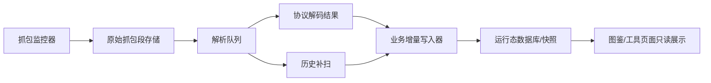

# 凡修抓包服务架构约定

本文是凡修抓包相关功能的架构入口。后续 agent 只要开发、修复或扩展凡修抓包能力，必须先读本文，再读 `docs/凡修运行态抓包观察事实层.md` 和 `docs/凡修逆向增量更新约定.md`。

## 背景与目标

凡修抓包不是图鉴页面的附属功能，也不是一次性脚本。它是一条持续运行的数据生产管线：

目标：

- 抓包监控器持续、按序、完整保存原始数据。
- 解析器按抓包序列升序消费，允许延迟，但不能跳包。
- 每个已探明业务域的解析结果都通过幂等的增量写入器落到数据库业务事实层。
- 图鉴、储物袋、活动页等前端只读取数据库查询接口，绝对禁止触发抓包、解码、补扫、同步或重建。
- 新解析规则发布后，必须能对历史抓包补扫，把过去漏掉的有效数据补回来。

这里的“业务域”指已经明确字段语义和用途的运行态数据，例如排行榜、玩家面板、储物袋、钱包资源、装备、玩法状态、拜谒记录等。JSON 文件可以作为调试快照、兼容产物或未知协议探索阶段的临时产物，但不能替代已探明业务域的数据库落库。

## 模块边界

### 抓包监控器

职责：

- 启动和守护抓包进程，例如 adb tcpdump 或将来的实时 socket 采集。
- 按序生成抓包段，记录 `segment_id`、时间范围、文件路径、大小、hash、状态。
- 保证原始抓包段完整可读；不要把写入中的 pcap 直接交给解析器。

禁止：

- 不解析业务协议。
- 不直接写储物袋、拜谒、活动排行等业务表。
- 不依赖前端页面刷新来触发存储。

### 抓包段存储

每段抓包至少要有这些状态：

- `capturing`：正在写入。
- `sealed`：已收口，文件完整。
- `queued`：等待解析。
- `parsing`：解析中。
- `parsed`：解析完成。
- `failed`：解析失败，可重试。

解析器只能消费 `sealed` 或之后状态的段。对 pcap 来说，必须先优雅停止或切段，避免 `tshark` 读到半包文件。

### 解析队列

职责：

- 按 `segment_id` 或 `captured_start_at` 升序串行解析。
- 解析速度可以落后抓包速度，但状态游标不能越过未处理段。
- 每个段保留解析版本、失败原因、重试次数、解码产物路径。
- 解析出协议帧后，只把“事实候选”交给业务写入器。

禁止：

- 为了追最新数据跳过旧段。
- 多个解析器同时写同一业务快照，除非业务写入器有明确事务和去重保护。
- 把解析器做成图鉴接口的同步副作用。

### 业务增量写入器

每个业务域单独设计 reducer/upsert 逻辑，例如：

- 储物袋：全量快照优先，按账号、区服、包时间保留最新快照，同时保留来源证据。
- 拜谒历史：按位面、榜单类型、时间、角色、友好度、来源协议去重。
- 活动排行：按活动实例、榜单类型、角色或账号、排名时间去重。
- 钱包资源：按资源类型和快照时间更新当前值，同时保留历史证据。

要求：

- 写入必须幂等，同一抓包段重复解析不能重复插入。
- 每条事实都保留证据：协议名、方向、packet id、record id、pcap 名、decoded 时间。
- 业务摘要可以覆盖更新，原始证据不能丢。
- 静态逆向 catalog 不应被运行态事实污染；运行态数据只作为 overlay。
- 无效数据的判定属于业务写入器职责。例如玩家面板必须有已探明的攻击字段才进入玩家面板表；无攻击的面板包不能覆盖有攻击的有效记录。
- 同一业务域可以先进入统一事实表，再按展示或查询需求拆成专表；但不能停留在前端内存或 JSON 快照里。

### 展示查询层

职责：

- 只读数据库中的业务事实或业务摘要。
- 按展示需求做过滤、分组、排序和字段精简。
- 可以显示“最新更新时间”等摘要，但这个时间来自数据库记录，不来自页面触发的抓包同步。
- 当用户对照图鉴页反馈“没有更新、解析错了、漏数据”时，优先把问题定位到抓包服务、解析队列、业务写入器或数据库查询，不要把图鉴页面改成同步触发器。

禁止：

- 打开页面时触发抓包补扫、协议解码或全量重建。
- 用前端请求作为抓包服务的同步驱动。
- 在图鉴页提供“同步抓包”“重建抓包洞察”“补扫历史抓包”之类按钮。
- 通过 `auto_sync=true` 的展示接口绕过抓包服务职责边界。
- 用无效快照覆盖数据库里已有的有效业务记录。

## 历史补扫

解析规则会不断优化，所以历史抓包里一定存在过去漏解析的数据。新增或修改解析规则时，必须同时考虑历史补扫。

推荐机制：

- 给每个解析器和业务写入器维护 `parser_version` / `rule_version`。
- 抓包段记录最后一次被哪些规则版本处理过。
- 新规则上线后，筛选“未被该版本处理过”的历史段，按时间升序补扫。
- 补扫写入仍走同一套幂等业务写入器。
- 补扫可以异步排队，但不能靠用户打开页面触发。

开发新解析功能的默认流程：

1. 找到协议和字段来源。
2. 写最小解析器和业务去重键。
3. 用当前抓包验证增量写入。
4. 对存量历史抓包跑补扫。
5. 验证前端只读接口能看到新增数据。
6. 把新增协议、字段、去重规则、补扫结果追加到文档或测试里。

## 当前代码映射

当前实现还没有完整的 `capture_segments` 数据表，但已有这些基础：

- `backend/core/fanxiu_capture_runtime.py`：adb tcpdump 抓包服务。
- `backend/core/fanxiu_tcp_flow.py`：pcap 解码、业务帧索引和 decoded 结果落盘。
- `backend/core/fanxiu_packet_insights.py`：运行态洞察聚合，包含储物袋、拜谒、账号资源等。
- `backend/core/fanxiu_packet_insight_worker.py`：后台补扫稳定的非空 live pcap，补齐未入 `tcp-flow` 的抓包段并同步运行态洞察。
- `backend/core/fanxiu_activity_packet_sync.py`：活动抓包增量同步。
- `backend/core/fanxiu_packet_business_store.py`：已探明抓包业务域的统一 SQL 事实写入器。
- `backend/core/fanxiu_player_profile_store.py`：玩家面板 SQL 专表写入器；只接收有攻击字段的有效面板记录。
- `frontend/src/standard/fanxiu/wiki/page.vue`：图鉴展示层，只应读取后端快照或查询接口。

现阶段如需继续完善抓包架构，应优先补齐：

- 抓包段清单和状态游标。
- 解析队列 worker。
- 按业务域拆分的幂等写入器。
- 历史补扫入口和版本记录。
- 服务日志中明确输出“抓包段收口、入队、解析、有效事实数、业务写入结果”。

## 设计判断规则

遇到抓包相关需求时，先判断它属于哪一层：

- “抓到了没有”：抓包监控器或抓包段存储问题。
- “为什么没解析”：解析队列、协议解码或历史补扫问题。
- “为什么图鉴没显示”：业务写入器或只读展示接口问题。
- “图鉴页看到的数据不对”：默认先查抓包服务是否捕获、解码和增量写库；只有数据库已有正确事实但展示错误时，才改图鉴页。
- “规则优化后旧数据怎么办”：历史补扫问题。

不要用页面刷新、接口超时、手动全量重建来掩盖边界问题。正确闭环永远是：

`原始抓包段完整保存 -> 解析队列按序消费 -> 业务幂等增量入库 -> 前端只读展示`
