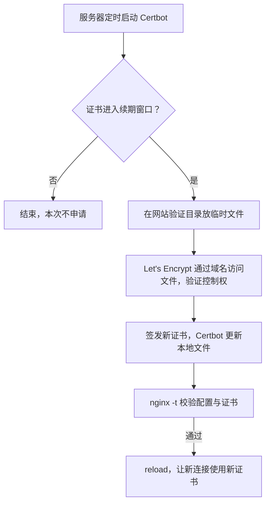

# CodeYun 本地开发与部署排障

## 本地开发主入口

- 统一使用 `uv run dev.py` 启动前后端；它是长驻进程，终端或工具等待超时不等于启动失败。
- 仅在 `uv` 不可用时使用 `.\.venv\Scripts\python.exe dev.py`，不要依赖全局 Python。
- 后台诊断日志写入 `%TEMP%\codeyun\...`，并分离 stdout/stderr；不得把服务日志写进仓库。

## 启动核查

先检查端口和受控进程，不使用 WMI 扫描进程命令行：

```powershell
netstat -ano | Select-String ':8000|:5173'
Get-Process python,node,uv -ErrorAction SilentlyContinue | Select-Object Id,ProcessName,Path
```

成功判据：

- 前端日志出现 `VITE ... ready`。
- 后端日志出现 `Application startup complete`。

重复调试前只清理命令行明确包含当前仓库 `dev.py`、`uvicorn` 或 `vite` 的残留进程，不能扩大到其他仓库或普通 Python/Node 进程。排查顺序为：

1. `uv sync`，确保依赖与锁文件一致。
2. 查看后端错误日志，优先处理导入和依赖错误。
3. 检查端口占用与重复进程。

## 部署现状

- 仓库内 GitHub Actions 自动部署链路已于 `2026-04-16` 移除；恢复旧方案只参考 [自动部署恢复档案](../../归档/自动部署恢复档案.md)。
- 服务器历史运行口径是系统级 `systemd` 服务 `codeyun-backend`，不是 `systemctl --user`；相关模板当前不在仓库中。
- 服务器 `.env` 只存应用配置，不存 SSH 登录信息。
- `CODEYUN_DATA_DIR` 可选；未配置时使用仓库外的 `C:\home\chenkunze\data\m2603codeyun\codepc_<本机名>`，不得回落到 `backend/data/`。

更完整的本机主控、守护和进程所有权设计见 [CodeYun 本机守护设计约定](../../平台/架构/CodeYun本机守护设计约定.md)。

## yun HTTPS 证书

自 `2026-09-20` 起，`code4101.com` 和 `www.code4101.com` 由 yun 本机的 **Certbot + Let's Encrypt** 自动申请、续期和部署证书。整个流程由服务器运行，不依赖本机电脑、AI、浏览器登录或腾讯云 API 密钥。腾讯云原有托管与自动续费设置未改动，但其证书已不再被本站 Nginx 使用。

### 原理与职责

HTTPS 使用 TLS（通常仍称 SSL）保护连接。证书由浏览器信任的签发机构签名，把域名与公钥绑定；服务器持有对应私钥，浏览器据此验证网站身份并建立加密连接。证书有有效期，“续期”实际是签发并加载一张新证书。

- **Let's Encrypt**：免费证书签发机构，负责验证域名控制权并签发证书。
- **Certbot**：运行在 yun 上的客户端，通过 ACME 协议完成申请、验证和续期，管理证书与私钥文件。
- **Nginx**：在 yun 上接收浏览器的 HTTPS 连接，使用证书与私钥完成 TLS 握手，再提供静态前端或把 API 请求转发到后端。因此证书配置在公网入口 yun，不在本机后端。



当前使用 **HTTP-01 验证**：验证根目录为 `/var/www/acme`，Nginx 将 `/.well-known/acme-challenge/` 请求映射到该目录。两个域名须继续解析到 yun，公网 80 端口和验证路径须保持可访问；签发时服务器还需能访问 Let's Encrypt。这个验证过程证明域名控制权，无需向签发机构提供云账号密码。

### 定时检查与部署

`certbot.timer` 每日触发两次检查，并带随机延迟以分散请求。**检查不等于签发**：当前配置约在证书剩余 30 天时才尝试续期，平时直接结束。保留默认频率，可以在网络或验证临时失败后继续重试；只在每月 1 日检查可能错过续期窗口。

Nginx 配置 `/etc/nginx/sites-available/code4101.com` 直接引用 `/etc/letsencrypt/live/code4101.com/` 下的 `fullchain.pem`（证书链）和 `privkey.pem`（私钥）。Certbot 管理这些稳定路径，后续不需要手动下载或上传文件。成功续期后，部署钩子 `/etc/letsencrypt/renewal-hooks/deploy/20-codeyun-nginx` 执行 `nginx -t`，通过后才 reload；校验失败则不重载，运行中的 Nginx 继续使用已加载的证书，并需根据日志排障。

### 核查与回退

以下命令在 yun 执行：

```sh
# 查看证书有效期和下一次检查时间
sudo certbot certificates
systemctl list-timers certbot.timer

# 用测试签发环境演练续期，并执行部署钩子；不会替换生产证书
sudo certbot renew --cert-name code4101.com --dry-run --run-deploy-hooks --no-random-sleep-on-renew

# 查看定时执行结果；详细日志在 /var/log/letsencrypt/letsencrypt.log
sudo journalctl -u certbot.service
```

首次部署已验证正式签发、两个域名的公网 HTTPS 访问、完整续期演练与 Nginx reload。切换前配置保存在 `/etc/nginx/backups/codeyun-acme-20260920/code4101.com`，原腾讯云证书仍在 `/etc/nginx/ssl/`；回退时先确认旧证书仍有效，再恢复配置、校验并 reload。

本文只记录原理、文件路径和维护命令，不记录登录账号、密码、API 凭据或私钥内容。私钥保存在服务器受限目录中，不应复制进文档、代码仓库或日志。
